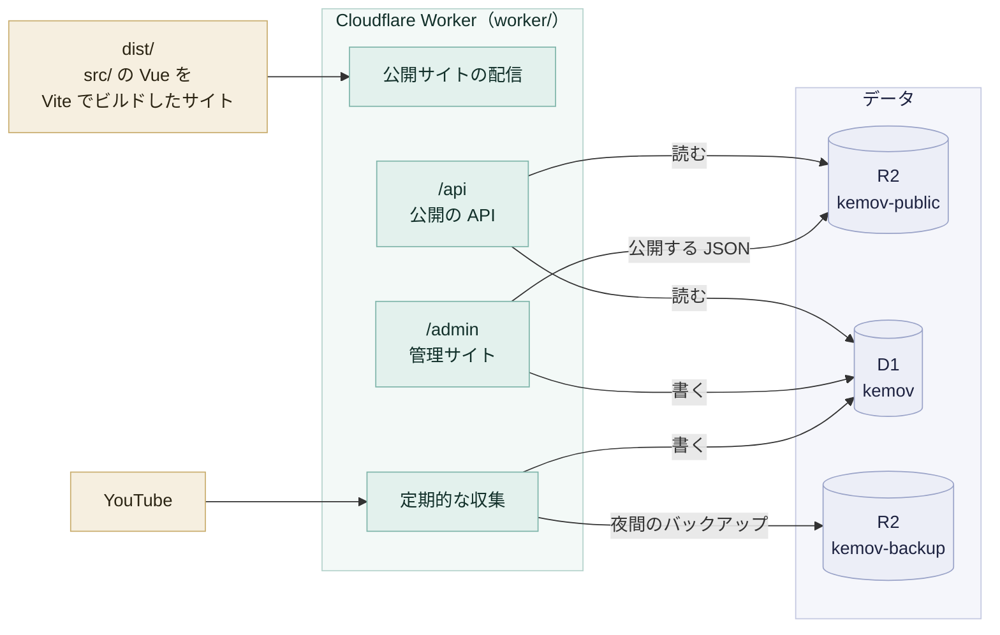

# kemov

けもV の非公式ファンサイトです 🐾

## 構成

サイトは `kemov.nanase.cc` で公開しています。1 つの Cloudflare Worker が、公開サイト・API・管理サイトの応答と、データの収集をまとめて受け持ちます。



- 公開サイトに出るデータは、すべて D1 から作り直せる
- `main` へ push すると、`Deploy` ワークフローが worker とサイトをまとめてデプロイする

詳しくは [全体の構成](docs/reference/architecture.md) にあります。

## 開発の始め方

bun と mise を使います。固定した版を入れ、依存を入れ、開発サーバーを起動します。

```sh
mise install
bun install --frozen-lockfile
bun run dev
```

環境変数・ビルド・テスト・worker の動かし方は [開発](docs/guides/development.md) にあります。

## 文書

仕組みと運用の文書は `docs/` にあります。

- 手順書
  - [開発](docs/guides/development.md): 手元で動かし、検査する
  - [マイグレーション](docs/guides/migrations.md): スキーマを変える
  - [復旧](docs/guides/recovery.md): 壊れたデータベースを戻す
  - [設定とデプロイ](docs/guides/deployment.md): Cloudflare と GitHub の設定、デプロイの戻し方
  - [メンバーの増減](docs/guides/members.md): メンバーを足す、活動終了日を書く、名前などを直す
- リファレンス
  - [全体の構成](docs/reference/architecture.md): 要求の受け分け、収集、デプロイ、仕様の索引
  - [管理サイト](docs/reference/admin.md): 設計の方針、認証、画面
  - [データ](docs/reference/data.md): D1 と R2、列の書き手、バックアップ
  - [公開の API](docs/reference/api/public.md): `/api` のエンドポイント
  - [管理サイトの API](docs/reference/api/admin.md): `/admin/api` のエンドポイント、公開の条件

## ライセンス

[MIT](LICENSE.md)

### 著作物について

けもV の著作物（画像など）の著作権は、[けものフレンズプロジェクト](https://kemono-friends.jp/)（KFP）と [けものフレンズVプロジェクト](https://www.kemov-project.com/)（KFPV）にあります。これらはこのリポジトリに含めてはいけません。使うときは、リンクで参照してください。
