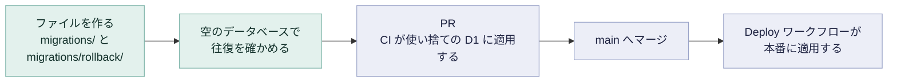

# マイグレーション

D1 のスキーマを変えるときの手順です。マイグレーションを足してから本番に適用されるまでの流れは、次のとおりです。



## マイグレーションの適用

`migrations/` には、変更 1 つにつき 1 つの SQL ファイルがあり、ファイル名の順に適用します。wrangler は適用したものを `d1_migrations` の表に記録するので、2 回適用しても 2 回目は何もしません。

手元の SQLite のファイルに適用するときは、Cloudflare のアカウントを使いません。

```sh
bun wrangler d1 migrations list kemov --local
bun wrangler d1 migrations apply kemov --local
```

本番のデータベースに適用するときは、アカウントの資格情報を使います。

```sh
bun wrangler d1 migrations apply kemov --remote
```

このコマンドは、ふつう手で打ちません。`Deploy` ワークフローがデプロイのたびに先に実行するので、マイグレーションは、それを前提とするコードと同じ push で本番のデータベースに届きます（[全体の構成](../reference/architecture.md#デプロイ)）。

## マイグレーションの追加

適用済みのファイルは決して書き換えません。wrangler はファイルを名前で追うので、書き換えた内容は新しく作るデータベースにだけ届き、既存のデータベースには届きません。すると、2 つのデータベースでスキーマが食い違います。スキーマを変えるときは、次のファイルを足します。

```sh
bun wrangler d1 migrations create kemov <what-it-does>
```

これで `migrations/000N_<what-it-does>.sql` ができます。そこに進める SQL を書き、それを取り消す SQL を `migrations/rollback/000N_<what-it-does>.sql` に書きます。

次に、2 つのファイルが空のデータベースで動くことを確かめます。手元のデータベースには前の実行の残りがあり、`migrations apply` は記録済みのファイルを飛ばします。まだ無いディレクトリを `--persist-to` に指定すれば、何も無いところから始められます。

```sh
bun wrangler d1 migrations apply kemov --local --persist-to .wrangler/check
bun wrangler d1 execute kemov --local --persist-to .wrangler/check --file migrations/rollback/000N_<what-it-does>.sql
rm -rf .wrangler/check
```

1 つ目のコマンドは、新しい 1 つだけでなく、すべてのマイグレーションを適用したと報告するはずです。報告が少なければ、ディレクトリは空ではありませんでした。

戻し方は [復旧](recovery.md#ロールバック) にあります。
