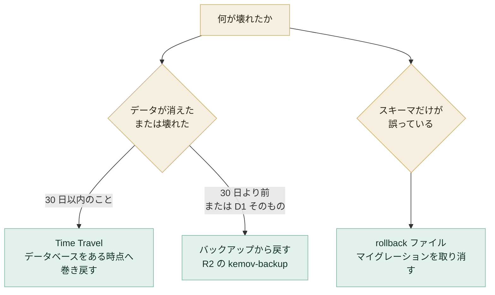

# 復旧

D1 のデータやスキーマが壊れたときに戻す手順です。何が壊れたかで、戻し方を選びます。デプロイしたコードを戻す手順は [設定とデプロイ](deployment.md#デプロイの戻し方) にあります。



## ロールバック

D1 には `migrations revert` がありません。戻す道は 2 つあり、何が起きたかでどちらかに決まります。

### Time Travel

データが消えたか壊れたときに使います。D1 は、Workers Paid のプランなら直近 30 日の任意の時点に戻せます。このプロジェクトは Workers Paid で動いています。無料のプランなら 7 日です。

スキーマと一緒にデータも巻き戻ります。選んだ時刻より後に収集したものは失われます。

```sh
bun wrangler d1 time-travel info kemov
bun wrangler d1 time-travel restore kemov --timestamp <ISO 8601>
```

### rollback ファイル

スキーマだけが誤っているときに使います。対になる rollback ファイルは、マイグレーションが作ったものを削除し、`d1_migrations` からその行を消します。そのため、直したファイルをあとで問題なく適用できます。削除した表にあったデータは、この道では戻りません。

```sh
bun wrangler d1 execute kemov --local --file migrations/rollback/0001_create_initial_schema.sql
```

手元のデータベース以外に対して実行するときは、先にそのファイルを読んでください。本番で使われてきたマイグレーションでは、スキーマが誤っていることより、表を失うことのほうが悪い結果になります。その場合の戻り道は Time Travel です。

## バックアップからの復元

R2 の `kemov-backup` にある SQL のファイルを、空のデータベースに適用して戻します。やることは次の 3 つです。

1. 戻す先のデータベースに、`migrations/` のすべてのファイルをファイル名の順に適用する
2. `kemov-backup` のファイルを、`channel` → `video` → `channel_snapshot` → …と `BACKED_UP_TABLES` の順に適用する。`source_whitelist` は最新のファイルを 1 つだけ適用する
3. 戻った行の数を数える

戻す先は空のデータベースを前提にしています。`kemov` そのものへ戻すときは、先に空にする手順が必要です（[`kemov` そのものへ戻す](#kemov-そのものへ戻す)）。

以下の `kemov-restore` は、戻す先のデータベースの名前に置き換えて読んでください。

### 1. スキーマを与える

バックアップのファイルは `INSERT` 文しか持たないので、表の無いデータベースではどれも失敗します。`migrations/` のすべてのファイルを、ファイル名の順に適用します。

`0001` だけでは足りません。`BACKED_UP_TABLES` にあとから足した表、たとえば `revision` や `publication`（`0005_add_revision_and_publication.sql` が作る）は、先にそのマイグレーションを適用しないと、同じようにバックアップのファイルが失敗します。

```sh
for f in migrations/*.sql; do
  bun wrangler d1 execute kemov-restore --remote --file "$f"
done
```

この手順で、`source_whitelist` にはマイグレーション `0008` が持つ 13 件の初期値も入ります。

`source_whitelist` のバックアップのファイルは、他と違って `DELETE FROM source_whitelist;` で始まります。適用すると、バックアップした時点の一覧がそのまま残り、誰かが取り除いた項目が初期値と一緒に戻ってくることはありません。同じ理由で、この表は最新のファイルだけを適用し、複数のファイルを順に適用しないでください。最後に適用したものが、そのまま一覧になります。

この書き方をするのは、行の集まりが全体で 1 つの答えになる表だけです（`TableShape` の `replace`）。記録が積み重なる表でこれをすると、バックアップの後に書いたものを捨ててしまいます。

### 2. `channel` から順にファイルを適用する

`video` と `channel_snapshot` はどちらも `channel` への外部キーを持ち、スキーマはチャンネルがまだ無い行を拒みます。`channel` の次に `video`、その次に `channel_snapshot` の各日を適用します。この順序はファイルごとの見出しにも書いてあるので、ファイルが 1 つだけ見つかった場合でも分かります。

```sh
bun wrangler r2 object get kemov-backup/channel/2026-09-08.sql --file channel.sql --remote
bun wrangler d1 execute kemov-restore --remote --file channel.sql
```

### 3. 確かめる

戻した先で、表ごとの行の数を `count(*)` で数えます。元のデータベースがまだ読めるなら、同じように数えて比べます。

どの文も `ON CONFLICT DO NOTHING` なので、同じファイルを 2 回適用しても 2 回目は何もしません。復元は落ち着いて行える作業ではありません。そのため、同じファイルを重ねて適用しても害が無い作りにしています。

### この手順を確かめた範囲

この手順は、2026-09-08 に Cloudflare 上の D1 と本番のバケットを使って、最後まで実行しました。当時あった 3 つの表 `channel`・`video`・`channel_snapshot` に対して、実際に打ったコマンドをもとに書いています。戻す先は、試験のために作った、空でマイグレーションもしていないデータベースでした。

- 11 チャンネル・6,433 本の動画・1,452 件のスナップショット、計 7,896 行が戻った
- どの行のどの列も、元と一致した
- 同じファイルを再実行すると `rows_written: 0` と報告し、件数は変わらなかった

その後、1 の手順のコマンドは、`BACKED_UP_TABLES` にあとから足したすべての表を含むように一般化しました。一般化した部分を何で確かめ、何で確かめていないかは、次の [まだ試していない範囲](#まだ試していない範囲) にあります。復元を始める前に読んでおいてください。

## まだ試していない範囲

ここから先は、本物のデータベースやバケットでの予行ではなく、推論です。どの場合も、いま出せる最善の答えを書いています。一部はその後手元で確かめたので、該当する箇所に記します。

### `kemov` そのものへ戻す

`DO NOTHING` は、無い行を戻し、ある行は中身が何であれそのままにします。行が消えたのではなく中身が誤っているデータベース、たとえば誤ったマイグレーションやおかしな値を書いたジョブの後では、何も変えずに成功と報告します。復元に意味を持たせるには、先に空にする必要があります。

`revision` と `publication` は、どちらもトリガーで `DELETE` を拒みます（[管理サイト](../reference/admin.md#設計の方針)）。追記だけという性質は、`worker/test/backup.test.ts` の `clearEverything` と同じくここでも効きます。そのため、次の `DELETE` のあいだだけトリガーを外し、すぐに付け直します。テストも同じことをしています。

2 つの `CREATE TRIGGER` の文は `migrations/0005_add_revision_and_publication.sql` から写しています。そのマイグレーションのトリガーの文を変えたのにここを直さなければ、食い違います。

```sh
bun wrangler d1 execute kemov --remote --command "
DROP TRIGGER revision_no_delete;
DROP TRIGGER publication_no_delete;

DELETE FROM chat_author;
DELETE FROM collect_task;
DELETE FROM genet_scene;
DELETE FROM genet_performance;
DELETE FROM genet_tune_video;
DELETE FROM genet_tune_score;
DELETE FROM genet_tune_attribute_person;
DELETE FROM genet_tune_attribute;
DELETE FROM genet_stream;
DELETE FROM genet_tune;
DELETE FROM genet_person;
DELETE FROM footprints_event_source;
DELETE FROM footprints_event_member;
DELETE FROM footprints_event;
DELETE FROM source_whitelist;
DELETE FROM channel_snapshot_exclusion;
DELETE FROM video_override;
DELETE FROM publication;
DELETE FROM revision;
DELETE FROM channel_snapshot;
DELETE FROM video;
DELETE FROM channel;

CREATE TRIGGER revision_no_delete BEFORE DELETE ON revision
BEGIN
  SELECT RAISE(ABORT, 'revision is append only');
END;

CREATE TRIGGER publication_no_delete BEFORE DELETE ON publication
BEGIN
  SELECT RAISE(ABORT, 'publication is append only');
END;
"
```

どこでも、子の表を親の表より先に消します。これは `BACKED_UP_TABLES` の逆順で、[rollback ファイル](#rollback-ファイル) と同じ順序であり、理由も同じです。

`collect_task` と `chat_author` はバックアップに無く、戻りません。どちらも 1〜2 回の tick で作り直されます。これらを失うのは空にすることの代償なので、先に [Time Travel](#time-travel) を検討してください。30 日以内なら、データベース全体をある時点へ戻せます。使えるときは、復元よりそちらが良い答えです。

### 手元で確かめたこと

本物のデータベースやバケットではなく、手元で確かめました。2026-09-17 に、手元の D1（`--persist-to` を使い、プロジェクトのふだんの開発用データベースとは別）で次を確かめました。

- すべてのマイグレーションをファイル名の順に適用すると（1 の手順を一般化した形）、`BACKED_UP_TABLES` のすべての表ができた
- 手で書いた `INSERT ... ON CONFLICT DO NOTHING` のファイルを適用すると、外部キーのエラー無しに、どの表にも 1 行ずつ入った
  - ファイルは表 1 つにつき 1 文で、`BACKED_UP_TABLES` の順に並べた
- それらの行があるデータベースに、上の `DROP TRIGGER` / `DELETE` / `CREATE TRIGGER` のまとまりを実行した
  - すべての表が空になった
  - 2 つのトリガーは、前と同じように以後の `DELETE` を拒んだ
  - 同じファイルをもう一度適用すると、行が戻った

本物のバックアップのファイルは使っていません。確かめた時点では、`genet_person` や `footprints_event` などの表は、夜間のジョブがまだ一度も書いていませんでした。そのため、手で書いたファイルで代えました。どちらの確認も、本物の `kemov` のデータベースと本物の `kemov-backup` のバケットには触れていません。

### `wrangler.toml` が名指ししないデータベースへの `migrations apply`

1 の手順がファイルを直接適用するのは、実際にそう実行したからです。`bun wrangler d1 migrations apply kemov --remote` は、このリポジトリが宣言するデータベースに対する文書どおりの道です。それが別の名前のデータベースにも使えるかどうかは、確かめていません。

1 の手順のようにファイルを直接適用すると、`d1_migrations` は空のままになります。一度読んで捨てるデータベースならそれで構いません。`kemov` の代わりにするデータベースでは誤りで、次の `migrations apply` が、既に表があるのに `0001` をもう一度適用しようとします。
