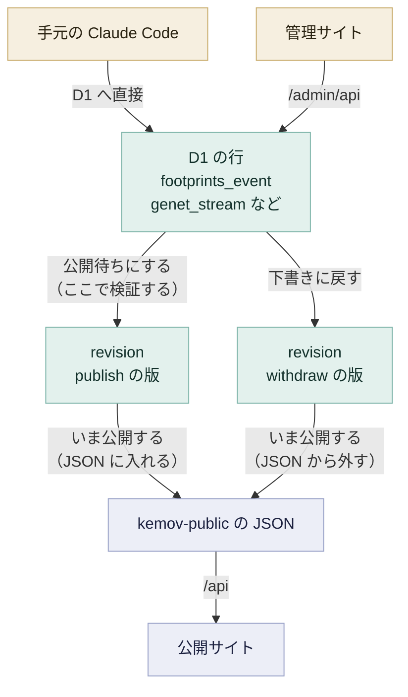

# 管理サイト

`/admin` は、人手で作るデータを直して公開するための管理サイトです（#141）。`/admin/api` がその API で、Cloudflare Access の後ろにあります。画面は `src/admin/`、API は `worker/src/admin/` にあります。

## 設計の方針

#141 で、次の 4 つを決めました。

- 読みと書きの経路を分ける
  - 読むのは `/api` で、公開され、キャッシュされる
  - 書くのは `/admin/api` で、Access の後ろにある
- 公開の状態を行に持つ
  - あしあとの `footprints_event` とジェネット楽曲一覧の `genet_stream` は、`status` の列を持つ
- 版の履歴は追記だけにする
  - `revision` と `publication` は、トリガーが `UPDATE` と `DELETE` を拒む
- 公開の条件は、公開するときに確かめる
  - 下書きのあいだは、条件を満たしていなくてよい

書き込みの入口は 2 つあります。手元の Claude Code は D1 へ直接書き、管理サイトは `/admin/api` を通ります。どちらから書いた行も、公開という 1 つの門を通らなければ公開サイトに出ません。そのため公開の条件はその門で確かめれば足り、Claude Code の側で守ることはありません。

公開の門を通るのは、あしあととジェネット楽曲一覧だけです。メンバー・動画の上書き・統計の除外は、保存した時点で効きます。出典のホワイトリストは公開の門の設定で、保存した時点で効きます。

## `/admin` と Cloudflare Access

`/admin/*` はサイトの書き込みの側です（#141）。`/admin/api/*` はその API で、worker が直接答え、背後にビルドしたファイルはありません。

それ以外の `/admin/*` のパスには、管理サイトそのもの（`src/admin/`、#144）を返します。ビルドしたページは `dist/admin/index.html` の 1 つだけで、パスが何であっても `ASSETS` からそれを返します。返すのは `worker/src/admin/index.ts` の `servePage` です。「1 つのファイルがこの下のすべてのパスに答える」という形は、`worker/src/pages/index.ts` が `/members/<id>` と `/videos/<id>` で使っているものと同じです。その 1 つのページがどの画面を出すかは、ブラウザの側で `src/admin/router.ts` が決め、worker は関わりません。

Cloudflare Access が `/admin` 全体の前に立ち、許可した人以外を実際に締め出します。Access の承認が無い要求は、worker に届きません。

worker も、`/admin/api/*` への要求をすべて `worker/src/lib/access.ts` で確かめます。Access の公開鍵を `https://${ACCESS_TEAM_DOMAIN}/cdn-cgi/access/certs` から取り、`Cf-Access-Jwt-Assertion` ヘッダーの署名・`iss`・`aud`・`exp`/`nbf` を、Access のエッジと同じように検証します。通らなければ要求を拒みます。

これは Access の代わりではありません。呼び出し元を認可するのは、あくまで `/admin` の前にある Access のポリシーです。この検証は、ポリシーが外れたり設定を誤ったりしたときに、D1 や公開用のバケットへ書く経路へ要求が素通りしないためにあります。以前の版は、署名を確かめずに `aud` だけを比べていました。#144 のレビューで、書き込みの経路には足りないとされ、署名を検証する形にしました（2026-09-18）。

`ACCESS_AUD` は、`/admin` の前にある Access のアプリケーションの `aud` タグです。`ACCESS_TEAM_DOMAIN` は Access のチームのドメイン（`<team>.cloudflareaccess.com` の形）で、シークレットではなく `wrangler.toml` の `[vars]` に置きます。Access のログイン画面でブラウザが既に向かうドメインと同じだからです。`ACCESS_AUD` か `ACCESS_TEAM_DOMAIN` のどちらかが無いとき、または鍵を取れないときは、Access のポリシーにかかわらず `/admin/api/*` への要求をすべて拒みます。

## エンドポイント

`/admin/api` のエンドポイント、公開の条件、出典のホワイトリストの判定は [管理サイトの API](api/admin.md) にあります。

## 画面

`src/admin/` は管理サイトのフロントエンドです（#141、#144）。素の Vue と素の HTML・CSS で書き、Vuetify を使いません。公開サイトの部品群から管理サイトを切り離すという #127 の決定を、ここにも当てはめています。

公開サイトと共有するのは、`src/shell/tokens.css` の色の変数だけです。公開サイトの外枠（`SiteNav.vue` など）とダークの配色は共有しません。#141 のデザインで管理サイトはライトだけと決まったので、`src/admin/index.html` は `<html data-theme="light">` に固定しています。これで、閲覧者の OS の設定にかかわらず、`tokens.css` の色はすべてライトの側になります。

`src/admin/router.ts` は、`#` のフラグメントではなく、クライアント側のルーター（`vue-router` の history モード）です。再読み込みや共有したリンクでも、同じ画面に戻れます。worker はどの `/admin/*` のパスにも同じページを返し（[`/admin` と Cloudflare Access](#admin-と-cloudflare-access)）、画面を選ぶのはブラウザに任せます。

`src/admin/AdminShell.vue` は、すべての画面を囲む外枠です。上端のバーには、ページの名前と `GET /admin/api/me` が返すメールアドレスを出します。サイドバーには 3 つの群（やること・データ・運用）を、公開サイトのメニューと同じ順に並べます。

- 数を出す項目は 2 つ
  - 公開は、`GET /admin/api/footprints/pending` の `pending` と `changed` を合わせた数
  - 収集の失敗は、`GET /admin/api/collect-tasks` の `count`
- それ以外の項目は、名前だけを出す
- サイドバーの行き先のうち、`src/admin/router.ts` に専用のルートが無いものは、`src/admin/pages/PlaceholderPage.vue` を出す

表と編集の欄の分け方（`.main`/`.pane`/`.inspector`）は、2 つの幅で狭くなります。`@media` ではなく `@container` を使う理由は、`src/admin/shell.css` のコメントにあります。

外枠のほかに、次の画面に触れておきます。

- あしあと（`src/admin/pages/FootprintsPage.vue`、`src/admin/components/FootprintsInspector.vue`）
  - 表は `status` と題の部分文字列で絞る
  - 編集の欄では、読む・保存・公開待ちにする/下書きに戻す・削除ができる
  - 公開の画面で「いま公開する」が JSON を書くまで、状態の表示は「公開待ち」のまま（`src/admin/lib/footprints-publish.ts`）
  - 保存の 400 は編集の欄の帯に出す。`src/admin/lib/footprints.ts` の `fieldForSaveError` が、worker のメッセージを読んで、どの欄の話かを示す。worker の検証をここにもう 1 つ写すことはしない
- 公開（`src/admin/pages/PublishPage.vue`）
  - あしあととジェネット楽曲一覧は、それぞれ `GET .../pending` の 2 つの一覧と「いま公開する」を持つ
  - 2 つは互いに独立して読み込み、公開する
- ジェネット楽曲一覧（`src/admin/pages/SetsPage.vue`）
  - `.pane`/`.inspector` を使わない唯一の画面で、代わりに `.setlist`/`.editor` を全幅で使う。配信のデータは、他の画面が使う細い編集の欄に収まらないため（#141 のデザイン）
  - 曲は、それを演奏するすべての配信で共有する。そのため、曲のクレジットの保存（`src/admin/lib/genet-tunes.ts`）は、配信の欄と演奏する曲・シーンの保存（`src/admin/lib/genet-streams.ts`）とは別の操作
  - Markdown の欄（曲の題、演奏の説明）は、書く欄の真下にその場のプレビューを出す。プレビューは公開サイトと同じ描画部品（`src/components/genet/MarkDown.vue`）を使う
  - Markdown の欄には、決まった形の Markdown のリンクをカーソルの位置に挿入するボタンがある。リンクの種類は Wikipedia・英語版 Wikipedia・配信のタイムスタンプ・URL そのもの
- メンバー（`src/admin/pages/MembersPage.vue`）
  - 名前・色・活動期間を直す。PUT で置き換えられるのは、`channel_id`・表示順・収集が書く 3 列を除いた列（#158）
  - 「＋ メンバーを足す」で、新しいメンバーを一覧の末尾に足します。表示順は各行の「↑」「↓」で動かします（#211）
  - 足した行と動かした順番は、「保存」を押すまで画面の中だけにあり、「未保存」と表示します。「保存」を押すと、足した行と全員の表示順を 1 回の batch で書きます。途中の並びは公開されません
  - 削除できるのは、`channel_snapshot`・`video`・`footprints_event_member` のどれにも行が無いメンバーだけです。記録が付いたあとは消さず、活動終了日で扱います
- 配信・動画（`src/admin/pages/VideosPage.vue`）
  - 収集した `video` の行を選び（`GET /admin/api/videos`）、`video_override` を付ける
  - 上書きそのものの保存と削除は、`video-overrides.ts` が受け持つ
- 統計（`src/admin/pages/SnapsPage.vue`）
  - 1 日ぶんの tick を出す（`GET /admin/api/snapshots`）
  - tick ごとに、tick そのものは消さずに、除外するかどうかを切り替えられる
- 収集の失敗（`src/admin/pages/CollectPage.vue`）
  - `failed` のまま止まった `collect_task` に、#141 が決めた 3 つの出口を用意する。いま再試行する、再試行せずに確認済みにする、動画を消えたものとして確定する、の 3 つ
- 版の履歴（`src/admin/pages/HistoryPage.vue`）
  - `revision` を種類・操作・日付の範囲で絞る
  - 1 行の `body` を、生の JSON ではなく欄ごとに開く
  - 同じ画面に `publication` の記録も並べる
- 出典ホワイトリスト（`src/admin/pages/SourceWhitelistPage.vue`）
  - [出典のホワイトリスト](api/admin.md#出典のホワイトリスト) の項目を足し、`note` を直し、取り除く

ブラウザ無しで確かめたい画面側の処理は、`src/admin/lib/*.ts` へ切り出し、`test/admin/lib/` でテストします。表のクエリ文字列、保存のエラーがどの欄を指すか、ある `status` で編集の欄がどのボタンを出すか、などです。このプロジェクトのフロントエンドが `src/lib/*.ts` で既に採っている分け方と同じです。
