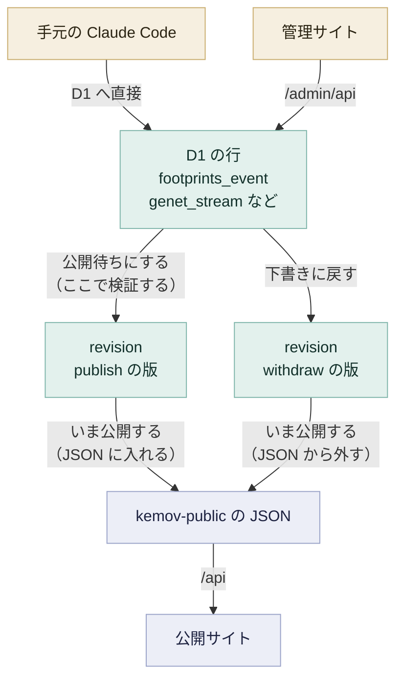

# 管理サイト

`/admin` は、人手で作るデータを直して公開するための管理サイトです（#141）。`/admin/api` がその API で、Cloudflare Access の後ろにあります。画面は `src/admin/`、API は `worker/src/admin/` にあります。

## 設計の方針

#141 で、次の 4 つを決めました。

- 読みと書きの経路を分ける
  - 読むのは `/api` で、公開され、キャッシュされる
  - 書くのは `/admin/api` で、Access の後ろにある
- 公開の状態を行に持つ
  - あしあとの `footprints_event`、ジェネット楽曲一覧の `genet_stream`、登録者数の節目の `subscriber_milestone` は、`status` の列を持つ
- 版の履歴は追記だけにする
  - `revision` と `publication` は、トリガーが `UPDATE` と `DELETE` を拒む
- 公開の条件は、公開するときに確かめる
  - 下書きのあいだは、条件を満たしていなくてよい

書き込みの入口は 2 つあります。手元の Claude Code は D1 へ直接書き、管理サイトは `/admin/api` を通ります。どちらから書いた行も、公開という 1 つの門を通らなければ公開サイトに出ません。そのため公開の条件はその門で確かめれば足り、Claude Code の側で守ることはありません。

```mermaid
flowchart TD
  cc["手元の Claude Code"] -- "D1 へ直接" --> rows["D1 の行<br/>footprints_event<br/>genet_stream など"]
  site["管理サイト"] -- "/admin/api" --> rows
  rows -- "公開待ちにする<br/>（ここで検証する）" --> rev["revision<br/>publish の版"]
  rows -- "下書きに戻す" --> rev2["revision<br/>withdraw の版"]
  rev -- "いま公開する<br/>（JSON に入れる）" --> json["kemov-public の JSON"]
  rev2 -- "いま公開する<br/>（JSON から外す）" --> json
  json -- "/api" --> pub["公開サイト"]
  classDef write fill:#f6efe0,stroke:#c9ad6e,color:#2b2413
  classDef store fill:#e3f1ed,stroke:#7fb5aa,color:#12302a
  classDef out fill:#eceef7,stroke:#9aa3c8,color:#1d2240
  class cc,site write
  class rows,rev,rev2 store
  class json,pub out
```

公開の門を通るのは、あしあと・ジェネット楽曲一覧・登録者数の節目だけです。メンバー・動画の上書き・統計の除外は、保存した時点で効きます。出典のホワイトリストは公開の門の設定で、保存した時点で効きます。

## `/admin` と Cloudflare Access

`/admin/*` はサイトの書き込みの側です（#141）。`/admin/api/*` はその API で、worker が直接答え、背後にビルドしたファイルはありません。

それ以外の `/admin/*` のパスには、管理サイトそのもの（`src/admin/`、#144）を返します。ビルドしたページは `dist/admin/index.html` の 1 つだけで、パスが何であっても `ASSETS` からそれを返します。返すのは `worker/src/admin/index.ts` の `servePage` です。「1 つのファイルがこの下のすべてのパスに答える」という形は、`worker/src/pages/index.ts` が `/members/<id>` と `/videos/<id>` で使っているものと同じです。その 1 つのページがどの画面を出すかは、ブラウザの側で `src/admin/router.ts` が決め、worker は関わりません。

Cloudflare Access が `/admin` 全体の前に立ち、許可した人以外を実際に締め出します。Access の承認が無い要求は、worker に届きません。

worker も、`/admin/api/*` への要求をすべて `worker/src/lib/access.ts` で確かめます。Access の公開鍵を `https://${ACCESS_TEAM_DOMAIN}/cdn-cgi/access/certs` から取り、`Cf-Access-Jwt-Assertion` ヘッダーの署名・`iss`・`aud`・`exp`/`nbf` を、Access のエッジと同じように検証します。通らなければ要求を拒みます。

これは Access の代わりではありません。呼び出し元を認可するのは、あくまで `/admin` の前にある Access のポリシーです。この検証は、ポリシーが外れたり設定を誤ったりしたときに、D1 や公開用のバケットへ書く経路へ要求が素通りしないためにあります。以前の版は、署名を確かめずに `aud` だけを比べていました。#144 のレビューで、書き込みの経路には足りないとされ、署名を検証する形にしました（2026-09-18）。

`ACCESS_AUD` は、`/admin` の前にある Access のアプリケーションの `aud` タグです。`ACCESS_TEAM_DOMAIN` は Access のチームのドメイン（`<team>.cloudflareaccess.com` の形）で、シークレットではなく `wrangler.toml` の `[vars]` に置きます。Access のログイン画面でブラウザが既に向かうドメインと同じだからです。`ACCESS_AUD` か `ACCESS_TEAM_DOMAIN` のどちらかが無いとき、または鍵を取れないときは、Access のポリシーにかかわらず `/admin/api/*` への要求をすべて拒みます。

## エンドポイント

`/admin/api` のエンドポイント、公開の条件、出典のホワイトリストの判定は [管理サイトの API](api/admin.md) にあります。

## 画面

`src/admin/` は管理サイトのフロントエンドです（#141、#144）。素の Vue と素の HTML・CSS で書き、Vuetify を使いません。公開サイトの部品群から管理サイトを切り離すという #127 の決定を、ここにも当てはめています。

公開サイトと共有するのは、`src/shell/tokens.css` の色の変数だけです。公開サイトの外枠（`SiteNav.vue` など）とダークの配色は共有しません。#141 のデザインで管理サイトはライトだけと決まったので、`src/admin/index.html` は `<html data-theme="light">` に固定しています。これで、閲覧者の OS の設定にかかわらず、`tokens.css` の色はすべてライトの側になります。

`src/admin/router.ts` は、`#` のフラグメントではなく、クライアント側のルーター（`vue-router` の history モード）です。再読み込みや共有したリンクでも、同じ画面に戻れます。worker はどの `/admin/*` のパスにも同じページを返し（[`/admin` と Cloudflare Access](#admin-と-cloudflare-access)）、画面を選ぶのはブラウザに任せます。

`src/admin/AdminShell.vue` は、すべての画面を囲む外枠です。上端のバーには、群・ページ・開いている項目の名前を並べたパンくずと、アカウントのメニューを出します。メニューにあるのは「公開サイトを開く」と「ログアウト」だけで、アカウントの名前やメールアドレスは出しません。ログアウトは Cloudflare Access の `/cdn-cgi/access/logout` へのリンクで、worker は関わりません。

サイドバーには 3 つの群（やること・データ・運用）を、公開サイトのメニューと同じ順に並べます。サイドバーは « で細い帯に畳め、» で開きます。畳んだかどうかはブラウザに覚えます。

- 数を出す項目は次のとおりです
  - 公開は、`GET /admin/api/footprints/pending` の `pending` と `changed` を合わせた数
  - 収集の失敗は、`GET /admin/api/collect-tasks` の `count`
  - 確認待ち・出典の確認待ち・公開待ちは、`GET /admin/api/inbox` が返す数
- それ以外の項目は、名前だけを出す
- サイドバーのどの項目にも当たらないパスには、`src/admin/pages/PlaceholderPage.vue` を出す

どの画面も、表（`.pane`）を上に、開いた項目の編集の欄（`.inspector`）を下に置きます。間の仕切り（`src/admin/components/SplitHandle.vue`）は、ドラッグと上下の矢印キーで動かし、ダブルクリックで元の高さに戻します。仕切りの位置は、画面ごとにブラウザに覚えます。編集の欄の項目は、幅に応じて最大 3 列に並べます。

編集の欄の「プレビュー」を押すと、欄の右に、公開ページでの見え方を出します（`src/admin/components/PreviewPane.vue`）。開いたかどうかは、すべての画面で 1 つの値としてブラウザに覚えます。中身は画面ごとに次のとおりです。

| 画面                                       | プレビューの中身                                                                                                                                                     |
| ------------------------------------------ | -------------------------------------------------------------------------------------------------------------------------------------------------------------------- |
| あしあと（確認待ち・出典の確認待ちを含む） | 年表のカード（公開サイトの `EventCard.vue`）と、それが載る日                                                                                                         |
| 登録者数の節目                             | グラフの点を押したときのカード（`MilestoneCard.vue`）と、そのメンバーのふしめのグラフ（`MilestoneTrail.vue`）。グラフは公開中の節目に、編集中の 1 件を差し込んで描く |
| メンバー                                   | 顔・名前・活動期間を、公開サイトの部品で寄せ集めた見本                                                                                                               |
| 配信・動画                                 | サムネイル・メンバー・題・種類の見本と、上書きで変わる場所の注記                                                                                                     |
| ジェネット楽曲一覧                         | 開いている曲の「楽曲」の欄（公開サイトの `SongDetail.vue`）。演奏した回数は、公開中の配信に、編集中の配信を差し込んで数える                                          |

- あしあと・節目・ジェネット楽曲一覧は、編集中の値を公開の JSON の形に直し、公開サイトと同じ読み手（`readFootprintEvents`、`readSubscriberMilestones`、`readGenetMusicData`）に通してから描きます（`src/admin/lib/preview-public.ts`）。公開ページで読めない値は、どの欄かを示して止めます
- 公開サイトの API（`/api/channels` など）は、管理サイトと同じオリジンにあり、Cloudflare Access がかかっていません。プレビューはそれを読みます（`src/admin/lib/public-data.ts`）
- プレビューはライトだけで描きます。書体は公開サイトと同じ Murecho です
- 統計の画面には、プレビューの代わりに、除いた tick が公開ページの数にどう効くかの注記を出します

狭い幅では、サイドバーを引き出しにし（860px 以下）、表と編集の欄を 1 つずつ出します（600px 以下）。`@media` ではなく `@container` を使う理由は、`src/admin/shell.css` のコメントにあります。

外枠のほかに、次の画面に触れておきます。

- あしあと（`src/admin/pages/FootprintsPage.vue`、`src/admin/components/FootprintsInspector.vue`）
  - 表は `status` と題の部分文字列で絞る
  - 編集の欄では、読む・保存・公開待ちにする/下書きに戻す・削除ができる
  - 公開の画面で「いま公開する」が JSON を書くまで、状態の表示は「公開待ち」のまま（`src/admin/lib/footprints-publish.ts`）
  - 保存の 400 は編集の欄の帯に出す。`src/admin/lib/footprints.ts` の `fieldForSaveError` が、worker のメッセージを読んで、どの欄の話かを示す。worker の検証をここにもう 1 つ写すことはしない
- 公開（`src/admin/pages/PublishPage.vue`）
  - あしあととジェネット楽曲一覧は、それぞれ `GET .../pending` の 2 つの一覧と「いま公開する」を持つ
  - 登録者数の節目も同じ形で並べます。一覧は、公開待ち・公開後の変更・つないだ出来事の変更（`eventChanged`）の 3 つです。「いま公開する」を押せるのは、worker が JSON を作り直す場合と同じく、公開待ち・`eventChanged`・古い形の JSON のどれかがあるときです（`src/admin/lib/subscriber-milestones-publish.ts`）
  - 3 つは互いに独立して読み込み、公開する
- 登録者数の節目（`src/admin/pages/SubscribersPage.vue`、`src/admin/components/SubscriberMilestoneInspector.vue`、#225）
  - 表はメンバーと `status` で絞り、達成の日の古い順に並べます
  - 編集の欄の作りは、あしあとと同じです。保存・公開待ちにする/下書きに戻す・削除ができます。公開中の節目は削除できないので、その旨を欄に出します
  - 「＋ 足す」は、あしあとと違って、その場で行を作りません。空の欄を開き、「保存」を押したときに作ります。日付と人数を空のまま作れないうえ、仮の値を入れると、公表された数のように残るおそれがあるためです
  - つなぐ出来事は、あしあとの `kind = 'milestone'` の出来事から選びます
  - 日付と人数は、人が公表を見て入力します。YouTube API の値を候補として出しません（#222）
  - リスナーの投稿の URL は、この画面にだけ出ます。公開の JSON には worker が入れません
- ジェネット楽曲一覧（`src/admin/pages/SetsPage.vue`）
  - `.pane`/`.inspector` の代わりに `.setlist`/`.editor` を使う。配信のデータは、項目を格子に並べる編集の欄ではなく、曲ごとの区切りで編集するため。上下の並べ方と仕切りは `.pane`/`.inspector` と同じ
  - 曲は、それを演奏するすべての配信で共有する。そのため、曲のクレジットの保存（`src/admin/lib/genet-tunes.ts`）は、配信の欄と演奏する曲・シーンの保存（`src/admin/lib/genet-streams.ts`）とは別の操作
  - Markdown の欄（曲の題、演奏の説明）は、書く欄の真下にその場のプレビューを出す。描き方は公開ページと同じ（`src/lib/genet/musicSong.ts` の `markdownHtml`）。原題は、公開ページと同じく Markdown として読まずにそのまま出す
  - Markdown の欄には、決まった形の Markdown のリンクをカーソルの位置に挿入するボタンがある。リンクの種類は Wikipedia・英語版 Wikipedia・配信のタイムスタンプ・URL そのもの
- メンバー（`src/admin/pages/MembersPage.vue`）
  - 名前・色・活動期間を直す。PUT で置き換えられるのは、`channel_id`・表示順・収集が書く 3 列を除いた列（#158）
  - 「＋ メンバーを足す」で、新しいメンバーを一覧の末尾に足します。表示順は各行の「↑」「↓」で動かします（#211）
  - 足した行と動かした順番は、「保存」を押すまで画面の中だけにあり、「未保存」と表示します。「保存」を押すと、足した行と全員の表示順を 1 回の batch で書きます。途中の並びは公開されません
  - 削除できるのは、`channel_snapshot`・`video`・`footprints_event_member`・`subscriber_milestone` のどれにも行が無いメンバーだけです。記録が付いたあとは消さず、活動終了日で扱います
  - 増えたとき・活動を終えたときの手順は [メンバーの増減](../guides/members.md) にあります
- 配信・動画（`src/admin/pages/VideosPage.vue`）
  - 収集した `video` の行を選び（`GET /admin/api/videos`）、`video_override` を付ける
  - 上書きそのものの保存と削除は、`video-overrides.ts` が受け持つ
- 統計（`src/admin/pages/SnapsPage.vue`）
  - 1 日ぶんの tick を出す（`GET /admin/api/snapshots`）
  - tick ごとに、tick そのものは消さずに、除外するかどうかを切り替えられる
- 確認待ち（`src/admin/pages/InboxReviewPage.vue`）
  - あしあとと楽曲一覧の行のうち、まだ誰も通していないものを 1 つの表に並べます。一度も公開していない下書きと、「あとで」に回した行（`status = 'review'`）です。「あとで」の行は、まだ見ていない行の後ろに並びます
  - #141 のデザインどおり、データの画面の絞り込みとして作っています。あしあとの行は `FootprintsInspector.vue` をそのまま使い、下のボタンだけを替えます
    - 承認して公開待ちにする: 「公開待ちにする」と同じ
    - あとで: 欄を保存し、`status` を `review` にする
    - 却下: 行を削除する。一度も公開していない行だけが並ぶので、取り下げは要りません
  - 楽曲一覧の行は細い欄に収まらないので、`GenetStreamReview.vue` が曲・開始時刻・メモを読むだけの形で出し、直すときは楽曲一覧の画面へ移ります
  - 選択の列でまとめて承認できます。1 行ずつ同じ道筋で通し、通らなかった行は飛ばして、最後に理由を一覧で出します（#237 と同じ作り）
  - `↑` `↓` で行を移り、`A` で選んでいる行を承認します
- 出典の確認待ち（`src/admin/pages/InboxSourcePage.vue`）
  - `sourcePending` の立ったあしあとの行を、`status` を問わず並べます
  - 「出典を確かめた」は、欄を保存してから印を外します。出典が公開の条件を満たさなければ、worker が断ります
  - 公開中の行は、印を外したあとも本番の年表は変わりません。あしあとで「公開待ちにする」を押します
- 公開待ち（`src/admin/pages/InboxPublishPage.vue`）
  - 次の「いま公開する」で本番に入るものと、本番から消えるもの（取り下げ待ち）を、あしあと・ジェネット楽曲一覧・登録者数の節目から並べます
  - この画面の「いま公開する」は、公開の画面のボタンのうち、することがあるものを順に押します
- 収集の失敗（`src/admin/pages/CollectPage.vue`）
  - `failed` のまま止まった `collect_task` に、#141 が決めた 3 つの出口を用意する。いま再試行する、再試行せずに確認済みにする、動画を消えたものとして確定する、の 3 つ
- 版の履歴（`src/admin/pages/HistoryPage.vue`）
  - `revision` を種類・操作・日付の範囲で絞る
  - 1 行の `body` を、生の JSON ではなく欄ごとに開く
  - 同じ画面に `publication` の記録も並べる
- 出典ホワイトリスト（`src/admin/pages/SourceWhitelistPage.vue`）
  - [出典のホワイトリスト](api/admin.md#出典のホワイトリスト) の項目を足し、`note` を直し、取り除く

ブラウザ無しで確かめたい画面側の処理は、`src/admin/lib/*.ts` へ切り出し、`test/admin/lib/` でテストします。表のクエリ文字列、保存のエラーがどの欄を指すか、ある `status` で編集の欄がどのボタンを出すか、などです。このプロジェクトのフロントエンドが `src/lib/*.ts` で既に採っている分け方と同じです。
