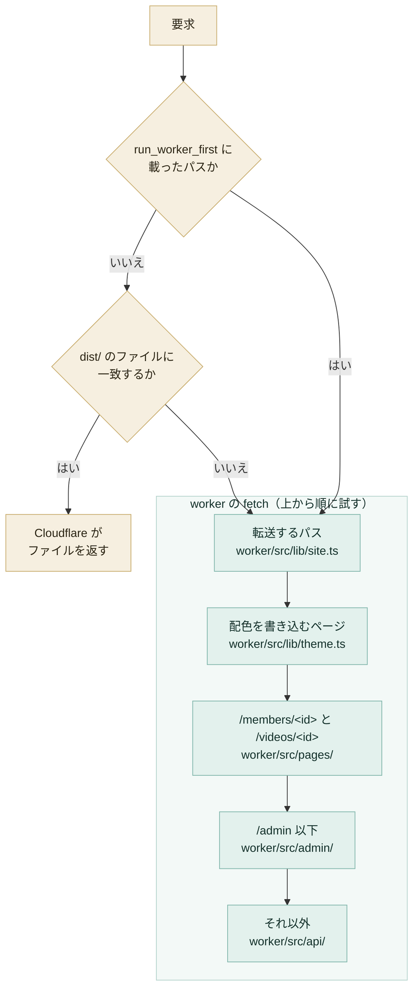
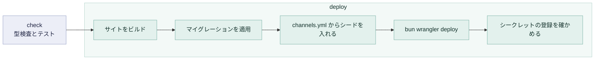

# 全体の構成

収集・API・管理サイト・公開サイトの配信は、1 つの Cloudflare Worker が受け持ちます。コードは `worker/` にあり、`src/` のフロントエンドとは分かれています。設定はリポジトリのルートの `wrangler.toml` にあります。

この文書は、要求の受け分け、収集、デプロイの仕組みと、そうした理由を扱います。ページごとの仕様は issue にあり、[仕様の索引](#仕様の索引) から辿れます。

## ディレクトリ

```text
worker/src/collector/   定期的に動く収集のジョブ
worker/src/api/         公開の HTTP API（/api）
worker/src/admin/       管理サイトの API（/admin/api）
worker/src/pages/       /members/<id> と /videos/<id>
worker/src/lib/         共有のコード
worker/test/            テスト
```

## 要求の受け分け

`wrangler.toml` は `dist/` を worker の静的アセットとして宣言しています。`bun wrangler deploy` は、ビルドしたサイトを `/api` に答えるコードと一緒にアップロードします。別のプロジェクトも GitHub Pages もありません。

Cloudflare は、ビルドしたファイルに一致する要求をそのまま返し、worker を起こしません。worker の `fetch` に届くのは、ファイルの無いパスと、`run_worker_first` に載せたパスだけです。サイトと API の境目は、ダッシュボードのルート設定ではなく、コードの分岐で決まります。



各段は、自分の受け持つパスでなければ次の段へ渡します。最後の `worker/src/api/` は、`/api` の下に無いパスにも 404 の JSON を返します。

`/admin` を `/api` より先に分けるのは、#141 で読みと書きの経路を分けたためです。`/api` は公開で、キャッシュされ、読むだけです。`/admin/api` は Cloudflare Access の後ろにあり、書き込みを受けます。`/api` の処理は読み以外のメソッドをすべて拒むので、`/admin` のパスが届いてはなりません。管理サイトの仕組みは [管理サイト](admin.md) に、2 つの API のエンドポイントは [公開の API](api/public.md) と [管理サイトの API](api/admin.md) にあります。

## 公開ページ

公開ページは、Vite が `src/` の下の `index.html` ごとにビルドします。どのページをビルドするかは `vite.config.ts` の `build.rollupOptions.input` が決めます。

| ページ             | URL             | ソース             |
| ------------------ | --------------- | ------------------ |
| けもV あしあと     | `/`             | `src/`             |
| 統計               | `/stats/`       | `src/stats/`       |
| メンバー           | `/members/`     | `src/members/`     |
| 配信・動画         | `/videos/`      | `src/videos/`      |
| ジェネット楽曲一覧 | `/genet/music/` | `src/genet/music/` |

URL とページ同士の遷移は、#137 の [確定した内容](https://github.com/nanase/kemov/issues/137#issuecomment-5704568645) が決めています。

### `/members/<id>` と `/videos/<id>`

`/members/<チャンネル ID>` と `/videos/<動画 ID>` は、メンバー 1 人、配信・動画 1 本を指す固定リンクです（#137）。共有したときに、サイトの題ではなくその名前が出るようにするためにあります。

ビルドしたページは `dist/members/index.html` と `dist/videos/index.html` の 1 つずつで、`vite.config.ts` が `src/members/` と `src/videos/` から作ります。`worker/src/pages/index.ts` は、`ASSETS` が `/members/` や `/videos/` で返すページを、要求された ID に合わせて書き換えます。`/members/<id>` にちょうど一致するファイルは無いので、Cloudflare は `/api/*` と同じように worker を起こします。

`wrangler.toml` の `[assets]` に `binding = "ASSETS"` があるのはこのためです。`directory` だけでは、Cloudflare が一致したファイルを返せるだけで、worker からファイルを取る手段がありません。`env.ASSETS.fetch()` は、Cloudflare が返すのと同じビルド済みのファイルを読みます。

ID は、D1 に問い合わせる前に YouTube の ID の形と照らします。チャンネルは `UC` に 22 文字が続く形、動画は 11 文字です。形が合わなければ、問い合わせずに 404 を返します。形が合っていても、D1 に行が無ければ 404 を返します。

行が見つかれば、ページの `<title>`・`og:title`・`og:url` を `HTMLRewriter` で書き換え、`ETag` を外します。`ETag` は書き換える前の本文を指しているので、残すと条件付きの要求に、違う題の本文で `304` を返すおそれがあります。

## 配色と cookie

閲覧者が選んだ `light` か `dark`（`ThemeToggle`）は、2 か所に残ります。1 つはページのスクリプトが読む `localStorage` で、もう 1 つは worker が読む同じ名前の cookie `kemov-theme` です（#182）。

cookie があるのは、ブラウザがページを読み解く前に、`color-scheme` の meta からキャンバスを塗るためです。その meta は `light dark` なので、OS がダークのままライトを選んだ閲覧者には、ページを移るたびに暗い画面が 1 コマ見えていました。ページの中のスクリプトでは、どれだけ早く動かしても防げません。

`worker/src/lib/theme.ts` は、ビルドした HTML のページを `HTMLRewriter` で返します。cookie が `light` か `dark` なら、`<html>` に `data-theme` を付け、`color-scheme` の meta をその値に絞ります。cookie が無いとき、`system` のとき、`light` でも `dark` でもないときは、手を加えずに返します。この判定は `src/shell/theme.ts` の `themeFromCookieHeader` だけが行い、フロントエンドと worker の両方がそれを呼びます。

- cookie は `light` か `dark` しか持たず、誰かを特定しない
  - 属性は `Path=/; SameSite=Lax; Secure` で、`Max-Age` は 1 年
  - スクリプトが書くので `HttpOnly` ではない
  - `system` は cookie が無い状態で表す
  - どこにも記録しない
- `head.html` のインラインのスクリプトは、cookie が無いか、保存した設定と食い違うときに、保存した設定を cookie へ写す
  - これが無いと、cookie ができる前に選んだ閲覧者は cookie を持てず、cookie の期限が切れた閲覧者はトグルを押し直すまでちらつく
  - そうした閲覧者は、デプロイ後の最初の訪問でだけ暗い画面を 1 コマ見る。2 回目からは正しく出る
- `wrangler.toml` の `run_worker_first` と `worker/src/lib/themed-pages.ts` は、同じ HTML のパスを並べる
  - `test/worker-config.test.ts` が、2 つが互いに一致し、`vite.config.ts` がビルドするページとも一致することを確かめる
  - ここに載せたパスは、ページを 1 回見るたびに worker を 1 回起こす
  - ハッシュ付きのスクリプト・スタイルシート・フォント・画像は載せず、worker を起こさずに返す
  - `/admin/` は載せない。ライトしか無いため
  - `color-scheme` の meta を持つページを足すときは、両方の一覧に足す
- 応答は `Cache-Control: private, no-cache` と `Vary: Cookie` を付け、`ETag` を付けない
  - 本文が cookie で変わるので、共有のキャッシュに置いてはならない
  - ファイルの `ETag` で `304` を返すと、別の設定向けに書いたページが残る
  - `no-store` にしないのは、ブラウザによっては戻る・進むでページを復元しなくなるため

## 収集

収集のジョブは、`wrangler.toml` の `[triggers]` の cron で動きます。どの cron がどのジョブを動かすかは `worker/src/collector/index.ts` の `jobsByCron` が決めます。1 つのジョブが失敗しても、同じ回の他のジョブは止まりません。

| ジョブ         | 周期                            | 読むもの                                                     |
| -------------- | ------------------------------- | ------------------------------------------------------------ |
| channel-stats  | 10 分ごと                       | YouTube Data API の `Channels.list`                          |
| video-discover | 10 分ごと                       | `PlaylistItems.list`、新しい動画があれば `Videos.list`       |
| video-update   | 10 分ごと                       | `Videos.list`                                                |
| chat-replay    | 1 分ごと                        | YouTube の画面が使う、チャットのリプレイの内部エンドポイント |
| backup         | 毎日 00:20 UTC（日本時間 9:20） | D1                                                           |
| retention      | 毎時 0 分                       | D1                                                           |

retention は 30 日を過ぎたデータを消します（[データ](data.md#30-日を過ぎたデータの削除)）。cron を足さず、10 分ごとの回のうち毎時 0 分の回で動きます。

channel-stats と video-discover は、回のたびに `channel` の全行を読み直します。`channel` に行が増えれば、次の回からそのチャンネルも読みます。

### YouTube Data API のクォータ

YouTube Data API の 1 日の上限は 10,000 units です（#58）。`Channels.list`・`PlaylistItems.list`・`Videos.list` は、どれも 1 回 1 unit を使います（根拠: YouTube Data API のドキュメント）。10 分ごとの回は、1 日に 144 回あります。チャンネル数を N とすると、1 日の消費は次のとおりです。

| ジョブ         | 1 回あたりの呼び出し                           | 1 日の units           |
| -------------- | ---------------------------------------------- | ---------------------- |
| channel-stats  | `Channels.list` を 1 回（50 チャンネルまで）   | 144                    |
| video-discover | `PlaylistItems.list` をチャンネルごとに 1 回   | 144 × N                |
| video-discover | 新しい動画があった回だけ `Videos.list` を 1 回 | 新しい動画がある回の数 |
| video-update   | `Videos.list` を 1 回（50 本まで）             | 144                    |

合計はおよそ 144 × (N + 2) units です。メンバーが 1 人増えると、1 日 144 units 増えます。チャットのリプレイは Data API を使わないので、クォータを消費しません。

## デプロイ

`Deploy` ワークフローが、worker とサイトをまとめてデプロイします。`main` への push のたびに動き、Actions のタブから手で動かすこともできます。

#70 まではワークフローが 2 つありました。2 つあると、片方だけが成功することがあります。実際に、worker がシークレットを 1 つも登録しないままデプロイに成功し、2 時間半のあいだ何も収集されませんでした。

ビルドの出力はコミットしません。`bun run build` は `dist/` に書き、`dist/` は git が無視します。



`check` のジョブは資格情報を持ちません。型検査とテストは、フロントエンドと worker の両方をここで行います。`deploy` のジョブだけが Cloudflare の資格情報を持ちます。

順序には次の理由があります。

- ビルドを最初に置く
  - 資格情報が無くても動き、ここで失敗したときに、デプロイされなかったコードのためのマイグレーションを残さないため
- マイグレーションをデプロイより前に置く
  - コードが自分より古いスキーマに出会わないため
  - `d1_migrations` の表があるので、マイグレーションを足さない push ではこの工程は何もしない
- シードをマイグレーションの後に置く
  - 列が先にできていないと入れられないため
- シードをデプロイより前に置く
  - シードは `channel` にまだ無いチャンネルの行だけを足す（[データ](data.md#シード)）
  - `channels.yml` に新しく載せたメンバーの行が無いまま、worker が動くことを避けるため
- シークレットの確認をデプロイの後に置く
  - シークレットは既にある worker に属するため
  - 手順は [設定とデプロイ](../guides/deployment.md#worker-のシークレット) にある

パスによる絞り込みはありません。Cloudflare で動くのは、常に `main` にあるものです。ワークフローが使う wrangler はロックファイルから入るので、リポジトリで検査した版でデプロイします。

## 決定の記録

#58 で、旧システムからの移行の骨格を決めました。

| 項目           | 決定                     | 理由                                                                                        |
| -------------- | ------------------------ | ------------------------------------------------------------------------------------------- |
| データの届け方 | HTTP API                 | 静的な JSON では、履歴・チャンネルをまたぐ集計・ページングができない                        |
| 実行基盤       | Cloudflare Workers と D1 | 収集・API・データベース・フロントエンドが 1 つの設定に収まり、追加の費用なしで SQL を使える |
| URL            | `kemov.nanase.cc`        | API とフロントエンドを同じオリジンに置ける                                                  |
| チャット数     | 自前で数える             | 止まった第三者の API に頼らないため                                                         |
| プラン         | Workers Paid             | 無料枠の CPU の上限では、チャットの巡回が収まらない                                         |

#58 は、`channel` の正データを「リポジトリの YAML」としていました。この決定は #141 で変わり、いまの正データは D1 にあります（[データ](data.md#列の書き手)）。

## 仕様の索引

ページごとの仕様は issue にあります。確定した内容が本文に無く、コメントにあるものは、コメントへ直接リンクします。

| issue | 対象               | 確定した内容の場所                                                             |
| ----- | ------------------ | ------------------------------------------------------------------------------ |
| #134  | 統計               | 本文                                                                           |
| #135  | 配信・動画         | 本文                                                                           |
| #136  | メンバー           | 本文とコメント                                                                 |
| #137  | 遷移と動的ルート   | [コメント](https://github.com/nanase/kemov/issues/137#issuecomment-5704568645) |
| #139  | ジェネット楽曲一覧 | 本文とコメント                                                                 |
| #140  | あしあと           | 本文とコメント                                                                 |
| #141  | 管理サイト         | コメント（次を参照）                                                           |

#141 は、確定した内容が複数のコメントに分かれています。主なものは次のとおりです。

- [書き込みの入口が 2 つになる](https://github.com/nanase/kemov/issues/141#issuecomment-5694552972)
- [書き込みの検証とメンバーの正データ](https://github.com/nanase/kemov/issues/141#issuecomment-5694682630)
- [画面の文言の決まり](https://github.com/nanase/kemov/issues/141#issuecomment-5694047145)
- [デザイン](https://github.com/nanase/kemov/issues/141#issuecomment-5695260204)
- [データ構造](https://github.com/nanase/kemov/issues/141#issuecomment-5704563615) と [その追加](https://github.com/nanase/kemov/issues/141#issuecomment-5708218825)
