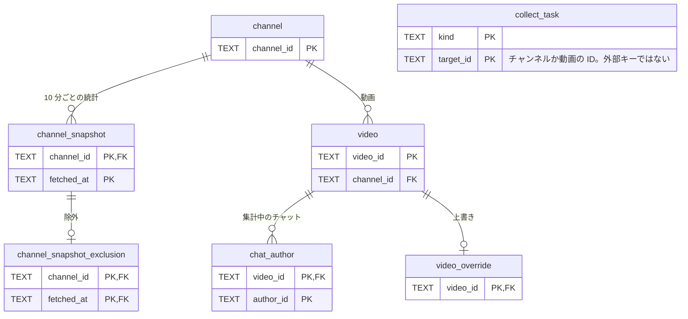
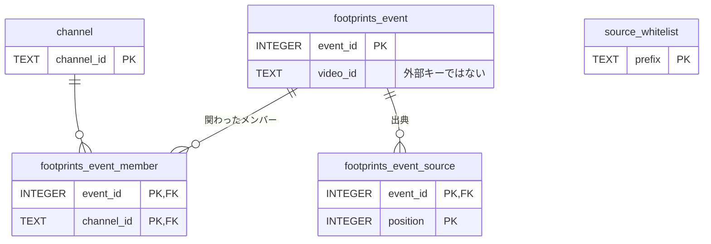
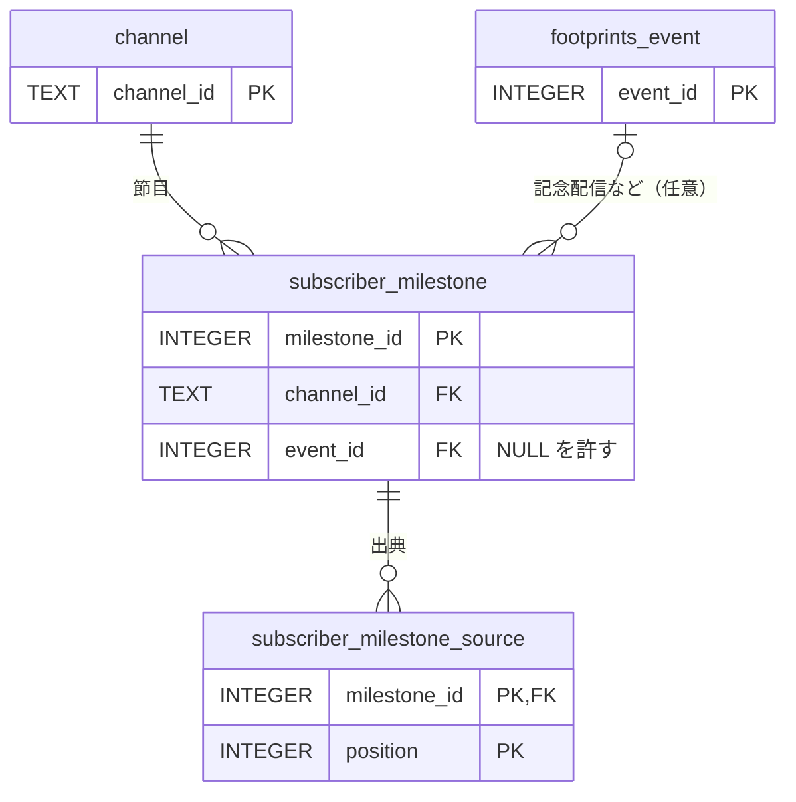
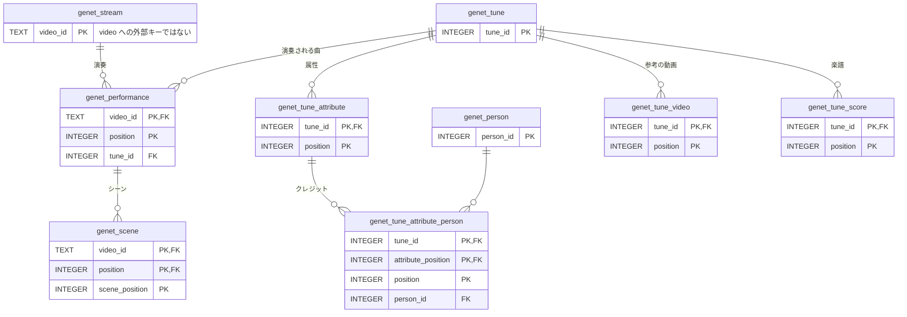
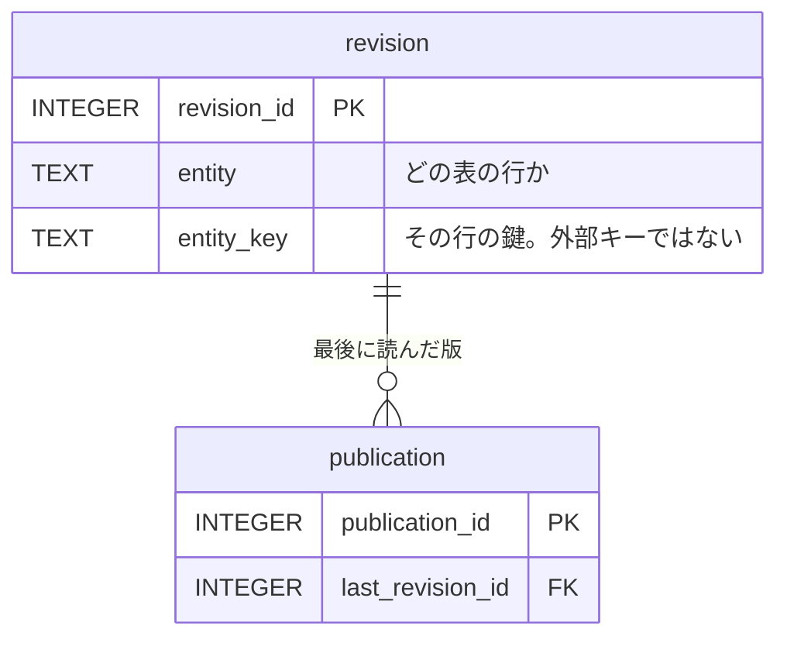
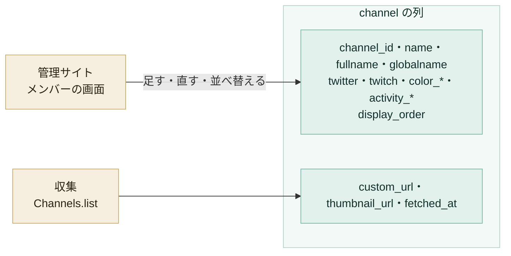
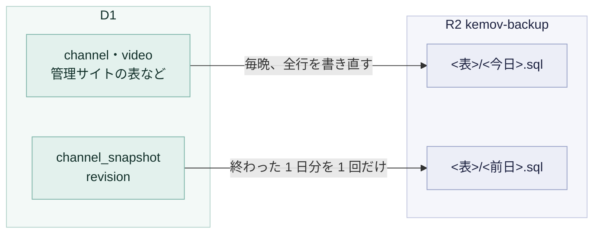

# データ

サイトのデータは D1 にあり、R2 にはバックアップと公開用の JSON を置きます。この文書は、どの列を誰が書くか、メンバーの足し方と消し方、30 日を過ぎたデータの削除、バックアップとその保持期間、公開用のバケットを扱います。

## データベース

収集したデータは、Cloudflare D1 の `kemov` というデータベースにあり、APAC のリージョンで動いています。サイトが公開するものは、すべてここから作り直せます。この文書のコマンドは wrangler を使います。準備は [開発](../guides/development.md#worker-の開発) にあります。

リージョンはデータベースを作るときに決まり、後から変えられません。移すには、別のデータベースを作ってデータを写すことになります。

## 表の関係

表と外部キーは `migrations/` が決めます。次の図は、そこから主キー（PK）と外部キー（FK）の列だけを写したものです。すべての列は各マイグレーションのファイルにあります。

### 収集と、その上書き



### あしあと



### 登録者数の節目



`subscriber_milestone` は、メンバー本人・公式・リスナーが公表した登録者数を、人が出典つきで記録する表です（#225）。`channel_snapshot` は 30 日しか持てないので、長い推移はこちらで持ちます。

- `reached_date` は、その人数に達した日（または月）。記念配信の日ではない
- `subscriber_count` は下限として読む。その日には少なくともその人数に達していた
- `announced_by` は、誰が公表したか（`member`・`official`・`listener`）
- `event_id` は、記念配信などのあしあとの出来事。つながなくてもよい

日付も人数も、YouTube API の値からは作りません（#222）。

### ジェネット楽曲一覧



### 版の履歴



`revision` は、`entity` と `entity_key` の組で、どの表のどの行の版かを示します。外部キーではないので、行を消しても版は残ります。

版は後から消せないので、YouTube API から取った値は本文に写しません。メンバーの版が `custom_url` と `thumbnail_url` を持たないのはこのためです（[管理 API](api/admin.md)）。

## 列の書き手

`channel` には書き手が 2 つあります。この分担を無視して書くと、もう一方の書いた内容を消してしまいます。



そのため、管理サイトは人が決める側の列だけを書き（[メンバー](#メンバー)）、収集は `custom_url`・`thumbnail_url`・`fetched_at` だけを書きます。

それ以外の表は、収集か管理サイト（[管理サイト](admin.md)）が書きます。両方が書くのは、管理サイトの収集の失敗の画面だけです。この画面は `collect_task` の行を更新し、`video.availability` を `unavailable` に確定することもあります。

## メンバー

メンバーの正は D1 の `channel` だけです。リポジトリに一覧のファイルは置かず、デプロイも `channel` に何も書きません。足す・直す・並べ替える・消す操作は、管理サイトのメンバーの画面から行います（[管理サイト](admin.md)）。手順は [メンバーの増減](../guides/members.md) にあります。

### 足すときの規則

メンバーを足す口は 2 つあり、同じ規則で検査します。1 人を末尾へ足す `POST /admin/api/members` と、画面の「保存」が送る `PUT /admin/api/members` です（[管理 API](api/admin.md)）。規則を満たさない値は 400 で断り、何も書きません。

| 欄                                                | 規則                                                                                             |
| ------------------------------------------------- | ------------------------------------------------------------------------------------------------ |
| `channelId`                                       | YouTube のチャンネル ID の形（`UC` と 22 文字）。既にあれば 409                                  |
| `name`・`fullname`                                | 空でない文字列                                                                                   |
| `globalname`                                      | 空でない文字列か null                                                                            |
| `twitter`                                         | `@` を付けない X のハンドル（英数字と `_`、1 〜 15 文字）か null                                 |
| `twitch`                                          | Twitch のログイン名（英数字と `_`、4 〜 25 文字）か null                                         |
| `colorKey`・`colorSub`・`colorLight`・`colorBack` | 4 つとも `#RRGGBB`（大文字でも小文字でもよい）                                                   |
| `activityStartDate`                               | 存在する日付（`YYYY-MM-DD`）                                                                     |
| `activityEndDate`                                 | 存在する日付か null。`activityStartDate` より前にはできない。null は、書かずに省くことはできない |
| 上の欄にないキー                                  | 断る                                                                                             |

`activityEndDate` は、属性ではなく状態です。省いた場合も null と読めますが、それでは「まだ活動中」と誰かが決めた結果なのかが分かりません。

`custom_url`・`thumbnail_url`・`fetched_at` は、収集が自分で書く列です。足したメンバーでは、最初の収集が書くまで NULL です。

### 表示順

サイトがメンバーを並べる順は `display_order` の昇順で、同じ値のときは `channel_id` の順です。公開のページも管理サイトも、同じ順を使います。

順番は 1 人ずつは変えません。画面の「↑」「↓」は画面の中だけで順番を動かし、足した行と合わせて「未保存」にします。「保存」を押したときに、足した行と全員の順番を、D1 の `batch` 1 回で書きます。`batch` は 1 つのトランザクションなので、途中の並びが公開されることはありません。

- 保存は、全員の `display_order` を 0 から連番に振り直す
  - 順番が変わらない行は書かず、版も残さない
- 保存の時点でメンバーの集合が、画面が読んだときと違えば、何も書かずに 409 を返す
  - 別の人が足したか消したかしたあとの一覧で、順番を上書きしないため
- `PUT /admin/api/members/<チャンネル ID>` は `display_order` を受けない
  - 古い編集欄の値で、保存済みの順番を上書きしないため

### 消せるとき

`DELETE /admin/api/members/<チャンネル ID>` は、`channel_snapshot`・`video`・`footprints_event_member`・`subscriber_milestone` のどれにも行が無いメンバーだけを消します。記録が付いたあとは 409 を返し、どの表に何件あるかを伝えます。

消すときは、そのメンバーあての `collect_task`（`channel_snapshot` にも `video` にも行が無いうちに、取得に失敗して残った予定）も同じ `batch` で消します。`collect_task` は `channel` への外部キーを持たないので、D1 は片づけてくれません。

`channel_snapshot`・`video`・`footprints_event_member`・`subscriber_milestone` は `channel` を参照しているので、記録の付いた行の削除は D1 も拒みます。この拒否はわざとです。誤って消した行が、何年分もの収集の履歴を道連れにしてはなりません。

記録は 30 日を過ぎると消えます（[30 日を過ぎたデータの削除](#30-日を過ぎたデータの削除)）。収集が 30 日以上失敗し続けたメンバーは、`channel_snapshot` の行が無くなるので、ほかの表にも行が無ければ消せるようになります。

### メンバーが活動を終えたとき

管理サイトのメンバーの画面で、そのメンバーの `activity_end_date` を書きます。行は消しません。活動を終えたメンバーにも、活動していたころの履歴は残ります。

### 手元の D1 にメンバーを入れる

手元の D1 は、マイグレーションを適用しただけではメンバーが 1 人もいません。`scripts/dev-members.sql` が作り物の 4 人を入れます。手順は [開発](../guides/development.md#手元の-d1-にメンバーを入れる) にあります。

## 30 日を過ぎたデータの削除

YouTube API Services の Developer Policies（III.E.4.d）は、チャンネルの持ち主の認可を得ずに API から取ったデータを、30 日までしか持つことを認めていません。このサイトの収集はどれも認可を得ていないので、[#222](https://github.com/nanase/kemov/issues/222) で、30 日を過ぎたものを消すと決めました。消すのは worker の retention のジョブです（`worker/src/collector/retention.ts`）。

| 消すもの                           | いつ消すか                     | 一緒に消すもの                                                  |
| ---------------------------------- | ------------------------------ | --------------------------------------------------------------- |
| `channel_snapshot` の行            | `fetched_at` から 30 日        | その行を指す `channel_snapshot_exclusion`                       |
| 取れなくなった動画（`video` の行） | `last_available_at` から 30 日 | その動画の `video_override`・`chat_author`・`collect_task` の行 |

- 取れなくなった動画は、`availability` が `unavailable` の動画
  - API が返さなくなった動画で、削除と非公開を区別できない
  - `private` の動画は、API が値を返し続けているので対象にしない
- あしあとの出来事とジェネット楽曲一覧の行は、消した動画を指していても残す
  - 外部キーでつながっておらず、中身は人が書いたもので、API から取った値ではないため
- 消したことは `revision` に記録しない
  - `created_via` が `claude_code` と `admin` しか受けないため
  - 消した除外の印や上書きは、版の履歴の上では最後の保存のまま残る

### いつ消し、どこを境にするか

10 分ごとの回のうち、毎時 0 分の回だけが消します。新しい cron を足すと、worker の実行回数が 1 時間に 1 回増えるためです。1 回の実行は 1 つの `batch` で、途中で失敗すれば何も消えず、次の 1 時間の回がやり直します。

境界は「実行した時刻 − 30 日 + 1 時間」で、これより前の行を消します。

- ある回で残った行は、その時点で 30 日より 1 時間以上新しい
- 次の回は 1 時間後で、それまでに行は 30 日を超えない
- 境界を「実行した時刻 − 30 日」にすると、次の回までの 1 時間、行が最長で 30 日と 1 時間残る

### 30 日の増減

`/api/channels` の 30 日の増減は、最新の行を「最新 − 30 日」以前で最も新しい行と比べます。その行は、上の境界より前にあるので消えています。

そのため 30 日の増減に限り、「最新 − 30 日」以前に行が無ければ、それより後 1 時間半以内で最も古い行と比べます。1 時間半は、削除の間隔の 1 時間と、回の刻みとずれの分です。比べる間隔は 30 日より短くなり、短さは最長で約 1 時間 20 分です。内訳は、毎時の回の間隔の 1 時間と、両端の行が 10 分ごとの回の刻みでずれる分です。1 時間半より後にしか行が無いときは、これまでどおり「この期間の記録がまだありません」になります。増減の許容の幅は 30 日の前後 3 日ですが（`worker/src/lib/delta.ts`）、そこまでは広げません。広げると、27 日しか収集していないチャンネルの 27 日の増減を、30 日の増減として出すためです。

1 時間と 1 日の増減は、比べる行が消えないので変わりません。

### 取れなくなった日

`video.last_available_at` が、取れなくなった動画を最後に取れた時刻を持ちます（マイグレーション 0009）。行の値はその時点のものなので、30 日はそこから数えます。

- 動画を初めて取れなかった回が、それまでの `fetched_at` を写す。以後の回は動かさない
- 動画がまた取れれば `NULL` に戻す
- 管理サイトで収集の失敗を「取れない」と確定したときも、同じように写す
- `fetched_at` と `collect_task.updated_at` は、取れなかった回のたびに進むので、この用には使えない

マイグレーションを当てた時点で既に取れなくなっていた動画は、2026-09-07 を入れました。本番の 73 本はどれも、18〜20 回続けて取れておらず、収集を始めた 2026-09-07 から一度も取れていないためです。

`last_available_at` が `NULL` の取れなくなった動画は、最後に取れた時刻が分からないので、次の回で消します。この列より前のバックアップから戻した行が、これにあたります。

### 止まったとき

`/api/health` の `retention` 欄が、D1 に残っている最も古い `channel_snapshot` と、最も古い `last_available_at` を返します。どちらかが 30 日と 10 分より古いか、`last_available_at` が `NULL` の取れなくなった動画があれば、`stale` が `true` になり、`/api/health` は 503 を返します。10 分は cron の開始のばらつきの分です。1 回でも毎時の回を逃すと、そこを超えます。

ジョブが走ったかどうかではなく、残っている行を見ます。走っても何も消さない誤りも、これで見つかります。

### 公開サイトへの影響

`/api/months` の登録者数は、各月の終わり以前で最も新しい `channel_snapshot` を使います。30 日を過ぎた月は、その行が消えるので欠けます。2026 年 9 月の値は、11 月以降に欠けます。長い期間の推移は、公表された節目から作り直します（[#225](https://github.com/nanase/kemov/issues/225)）。

Time Travel やバックアップから戻した行も、30 日を過ぎていれば次の回で消えます。

## バックアップ

[Time Travel](../guides/recovery.md#time-travel) で戻せるのは直近 30 日で、しかも D1 の中だけです。夜間のバックアップは、それより前のことと、D1 そのものに起きたことを受け持ちます。毎日 00:20 UTC（日本時間 9:20）に、worker がデータベースの中身を SQL として R2 のバケット `kemov-backup` へ書きます。

```text
channel/2026-09-08.sql              全行。毎晩書き直す
video/2026-09-08.sql                全行。毎晩書き直す
channel_snapshot/2026-09-07.sql     終わった 1 日分。1 回だけ書く
revision/2026-09-07.sql             終わった 1 日分。1 回だけ書く
publication/2026-09-08.sql          全行。毎晩書き直す
```



ほとんどの表は、今の値がすべてなので、毎晩まるごと書きます。`channel` と `video` のほか、[#144](https://github.com/nanase/kemov/issues/144) で管理サイトが足した表はすべてこちらです。

ただし `video` のファイルには、最後に取れてから 2 日を過ぎた動画を入れません。その行の値は最後に取れた時点のもので、ファイルは R2 に最長 28 日残るため、2 日を過ぎた行を入れると 30 日を超えてしまいます（[保持期間](#保持期間)）。最後に取れた時刻は、取れる動画なら `fetched_at`、取れなくなった動画なら `last_available_at` です。

- 取れなくなって 2 日を過ぎた動画は、バックアップから戻しても戻らない。どれも公開サイトの集計には入らない行で、集計は `availability` が `public` の動画だけを数える
- 取れる動画が抜けるのは、video-update が 2 日のうちに読み直せなかったときだけ。ファイルは抜いた行の数をメタデータに持ち、取れる動画が 1 本でも抜ければ `/api/health` の `backup` 欄の `video` が `stale` になる
- その手前で気づけるよう、`/api/health` の `videoSweep` 欄が、取れる動画のうち最も古い `fetched_at` を返す。36 時間を超えると `behind` が `true` になる。状態コードは変えない警告である

`channel_snapshot` と `revision` は違います。どちらも行を足すだけで書き換えないので、終わった 1 日分を 1 つのファイルとして 1 回だけ書き、以後は触りません。これで 1 晩の仕事の量は、表の大きさではなく 1 日分の大きさで済みます。`channel_snapshot` の 1 日の行数は 144 × チャンネル数で、11 チャンネルなら 1 日 1,584 行です。D1 には 30 日分までしか残りません（[30 日を過ぎたデータの削除](#30-日を過ぎたデータの削除)）。

1 回の実行が書くのは、抜けている日のうち最大 7 日分です。止まっていた期間の穴は、一度にすべて埋めようとせず、何晩かかけて埋まります。どの日を書き終えたかは、どこにも覚えておかず、バケットから読みます。そのため食い違う記録が生まれません。

`channel_snapshot` だけは、前日の分しか書きません。書き漏らした日は、次の晩にも埋めません。遅れて書いたファイルも R2 には同じ日数だけ残るので、その分だけ中の行が古くなり、30 日を超えるためです。

そのため、R2 に無い行を指す行がファイルに残ります。R2 に無い `channel_snapshot` を指す `channel_snapshot_exclusion` と、R2 に無い `video` を指す `video_override` です。この 2 つの表のファイルは、戻す先のデータベースに指す先が無い行を、拒まずに飛ばします。拒むと、同じ `INSERT` に入った他の行まで戻らないためです。

ファイルの中の 1 つの `INSERT` は、最大 200 行、かつ最大 80,000 バイトで、先に達したほうで区切ります。D1 は 100,000 バイトを超える文を拒み、行数だけではバイト数が決まりません。

- 2026-09-08 に本番の `video` の 6,433 行で測ると、200 行ずつの区切りは、バックアップが読む順では最大 73,687 バイト、別の組み方では最大 86,890 バイトになった
- 上限にどこまで近づくかは、何行あるかではなく、どの行が同じ区切りに入るかで決まる
- `video` は増える一方

D1 が拒む文があっても、見つかるのはそのファイルから戻そうとしたときです。それは見つけるのに最も悪いタイミングです。

`collect_task` と `chat_author` は、わざとバックアップから外しています。どちらも収集がどこまで進んだかを持つだけで、1〜2 回の tick で作り直されます。戻すと、チャットのジョブが読み終えたリプレイをもう一度読むことになります。

[#115](https://github.com/nanase/kemov/issues/115) から、`/api/health` はこのジョブも見ています。このジョブは `collect_task` の行を書かないので、`/api/health` の `backup` 欄はバケットを読みます。表ごとに、ファイルのある最新の日と、それが何日前かを返します。[#223](https://github.com/nanase/kemov/issues/223) から、期限を過ぎたのに残るファイルの数（`expiredFiles`）と、`video` のファイルが抜いた取れる動画の数（`omittedAlarming`）も返し、どちらかが 1 以上なら `stale` になります。`channel_snapshot` と `revision` は、今日ではなく前日の終わった 1 日分を書くので、何も起きていなくても他の表より 1 日古く出ます。どれだけ古ければ異常かは、この欄は示しません。その閾値は [#110](https://github.com/nanase/kemov/issues/110) が決めます。

## 保持期間

`kemov-backup` には、既にある Default Multipart Abort Rule に加えて、prefix ごとのライフサイクルルールを置いています。バケット全体に 1 つの規則をかけると、どこかの prefix で誤りになるためです。規則の設定の手順は [設定とデプロイ](../guides/deployment.md#バックアップのバケットの保持期間) にあります。

YouTube API のデータを持つ `video/`・`channel/`・`channel_snapshot/` は、夜間のバックアップが、キーの日付から期限を過ぎたファイルを自分で消します（#223）。R2 がライフサイクルルールで期限を過ぎたオブジェクトを消すのは「通常 24 時間以内」で（根拠: Cloudflare のドキュメント）、上限は保証されていないためです。ライフサイクルルールは、ジョブが動かなかったときの保険として残しています。

| prefix              | 保持期間 | 理由                                                                                                          |
| ------------------- | -------- | ------------------------------------------------------------------------------------------------------------- |
| `video/`            | 27 日    | YouTube API から取ったデータを 30 日までしか持てない。ファイルはどれも完全な写しで、最新の 1 つがあれば足りる |
| `channel_snapshot/` | 27 日    | YouTube API から取ったデータを 30 日までしか持てない                                                          |
| `channel/`          | 27 日    | YouTube API から取った `custom_url` と `thumbnail_url` を含む。[`channel/`](#channel) を参照                  |
| 次の一覧            | 365 日   | 次を参照                                                                                                      |

365 日の規則を置く prefix は、`channel_snapshot_exclusion/`・`video_override/`・`footprints_event/`・`footprints_event_member/`・`footprints_event_source/`・`subscriber_milestone/`・`subscriber_milestone_source/`・`source_whitelist/`・`genet_person/`・`genet_tune/`・`genet_tune_attribute/`・`genet_tune_attribute_person/`・`genet_tune_video/`・`genet_tune_score/`・`genet_stream/`・`genet_performance/`・`genet_scene/`・`revision/`・`publication/` です。

### 27 日の根拠

夜間のバックアップは、書いてから 27 日たったファイルを、その晩の 00:20 UTC に消します。1 晩動かなければ、次の晩の実行か、ライフサイクルルールが消します。そのためファイルは最長で 28 日残り、中のデータは、書いた時点でその分だけ古くなっています。27 日なら、どの prefix もデータは 30 日を超えません。

| prefix              | 書いた時点のデータの古さ | ファイルが残る期間 | 最も古いデータの古さ |
| ------------------- | ------------------------ | ------------------ | -------------------- |
| `channel_snapshot/` | 最大 1 日と 20 分        | 最長 28 日         | 29 日と 20 分        |
| `video/`            | 最大 2 日                | 最長 28 日         | 30 日                |
| `channel/` の 2 列  | 最大 1 日                | 最長 28 日         | 29 日                |

`channel_snapshot/` のキーは、行の日付で、書いた日の前日です。そのため、キーの日付から 28 日で消します。

- `channel_snapshot/` の X 日のファイルは、X+1 日の 00:20 UTC に書く。中身は X 日の 00:00 からの行
  - 遅れて書くと、その分だけ古くなる。そのため前日の分しか書かない（[バックアップ](#バックアップ)）
- `video/` には、最後に取れてから 2 日以内の動画だけを入れる（[バックアップ](#バックアップ)）
  - 取れる動画は、video-update がすべてを順に読み直す。1 巡は最長で「動画の数 ÷ ((50 − 20) × 144)」日で、2026-09-25 の 6,460 本なら約 1.5 日（36 時間）
  - 50 は 1 回に読む本数、20 はそのうち配信中・配信予定に先に回す上限、144 は 1 日の回数（`worker/src/collector/video.ts`）
  - 動画が 8,640 本を超えると 1 巡が 2 日を超え、読み直しの遅い動画から写しに入らなくなる。`/api/health` の `videoSweep` がその手前で警告する
- `channel/` の `custom_url` と `thumbnail_url` は、取ってから 1 日を超えたものを NULL にして書く（[`channel/`](#channel)）

### 365 日の側

`revision/` は 1 日に 1 ファイルで、その日を持つファイルは他にありません。1 つ消えれば、何も埋められない穴になります。

ただし、それは R2 の中の穴で、履歴そのものの穴ではありません。`revision` は D1 の中で行が増える一方なので（[バックアップ](#バックアップ)）、D1 はどの日も持ち続けています。R2 の写しは、D1 が壊れたときに D1 を戻すためにあります。その必要は障害の直後に来るもので、1 年後には来ません。365 日は、写しがその出番を待つ期間の上限であって、履歴が残る期間ではありません。

365 日の側の他の表は、収集が取り直せるデータではなく、人が管理サイトで一度だけ入力したデータを持ちます。`channel_snapshot_exclusion/` は `channel_snapshot` の行を指しますが、持つのはチャンネル・時刻・理由だけで、YouTube API から取った値は持ちません。

### `channel/`

`channel/` は 27 日です。`channel` は人が直す表ですが、YouTube API から取った `custom_url` と `thumbnail_url` も持ちます。この 2 列を持ってよいのは 30 日までです（[#222](https://github.com/nanase/kemov/issues/222)）。30 日には、ファイルが残る期間と、書いた時点での値の古さの両方が収まる必要があります（[#224](https://github.com/nanase/kemov/issues/224)）。

- ファイルは、夜間のバックアップが 27 日で消す。1 晩動かなければ、次の晩かライフサイクルルールが消す
- 値の古さには 1 日を残す。バックアップは、取ってから 1 日を超えた 2 列を NULL にして書く

収集は実行のたびに 2 列を書き直すので、ふだんの値は数分しか古くありません。1 日を超えるのは、`Channels.list` がそのチャンネルを返さなくなったときか、収集が止まったときです。このとき復元した行の 2 列は NULL になり、次の収集で埋まります。

D1 の `channel` の 2 列も、30 日を超えては持ちません。バックアップのジョブは、表を読む前に、取ってから 27 日を超えた 2 列を NULL にします。ジョブは 1 日 1 回なので、値は 28 日を超える前に消えます。消えたチャンネルは、公開のページで代替のアイコンになり、YouTube のチャンネルへのリンクが出なくなります。収集がまたそのチャンネルを取れば、元に戻ります。

短くしても、D1 を戻すのには困りません。毎晩の 1 つが表全体の写しなので、戻すには最新の 1 つで足ります。人が決める列の古い値は、27 日分のバックアップに残ります。管理サイトで足した値・直した値は、メンバーの版（`revision`）にも残り、こちらは消えません。

量の見積もりは次のとおりです。どれも 2026-09-08 に本番の値で測りました。

- `channel_snapshot` の 1 日分は SQL で約 119 KiB なので、27 日分で約 3.1 MiB
- `video` は 30 日分で約 70 MB と測った。27 日分なら約 63 MB。`channel` の数十行は、この数字をほとんど動かさない
- どちらも R2 の無料枠 10 GB に十分収まる。#144 で足した表は、どれも多くて数百行で、ほとんど足さない

## 公開用のデータ

管理サイトは、JSON を専用のバケット `kemov-public` へ公開します。worker からは `PUBLIC_DATA` というバインディングで読み書きします（#144）。ライフサイクルルールは置きません。公開は毎回同じキーを上書きするので、規則で期限切れにする古いオブジェクトが生まれないためです。

このバケットはバックアップしません。公開したオブジェクトはすべて `revision` から作り、`revision` はバックアップしています。`kemov-public` を失っても、失うのはデータではなく、公開し直す手間だけです。`collect_task` と `chat_author` を `kemov-backup` から外す（[バックアップ](#バックアップ)）のと同じ理屈を、表ではなくバケットに当てはめています。

管理サイトの公開の操作がこのバケットに書き（[あしあと](api/admin.md#あしあと)、[ジェネット楽曲一覧](api/admin.md#ジェネット楽曲一覧)、[登録者数の節目](api/admin.md#登録者数の節目)）、`/api` がそれを返します（[公開の API](api/public.md#公開用のバケットを返すエンドポイント)）。

バケットの作り方は [設定とデプロイ](../guides/deployment.md#公開用のバケット) にあります。
