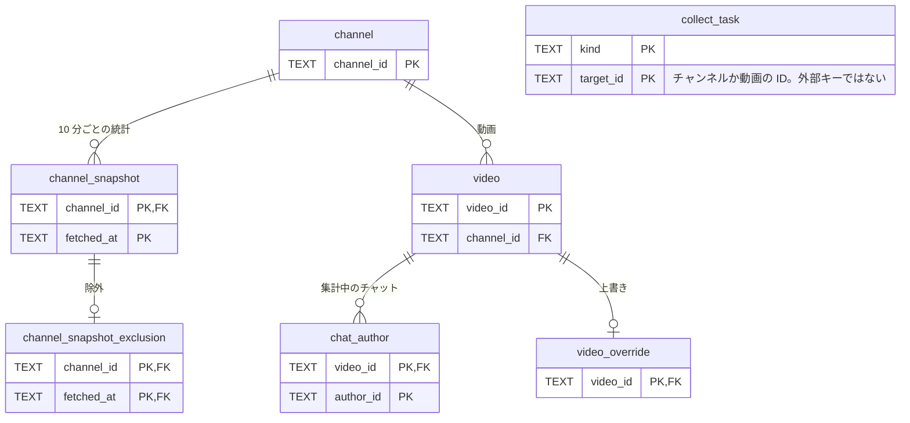
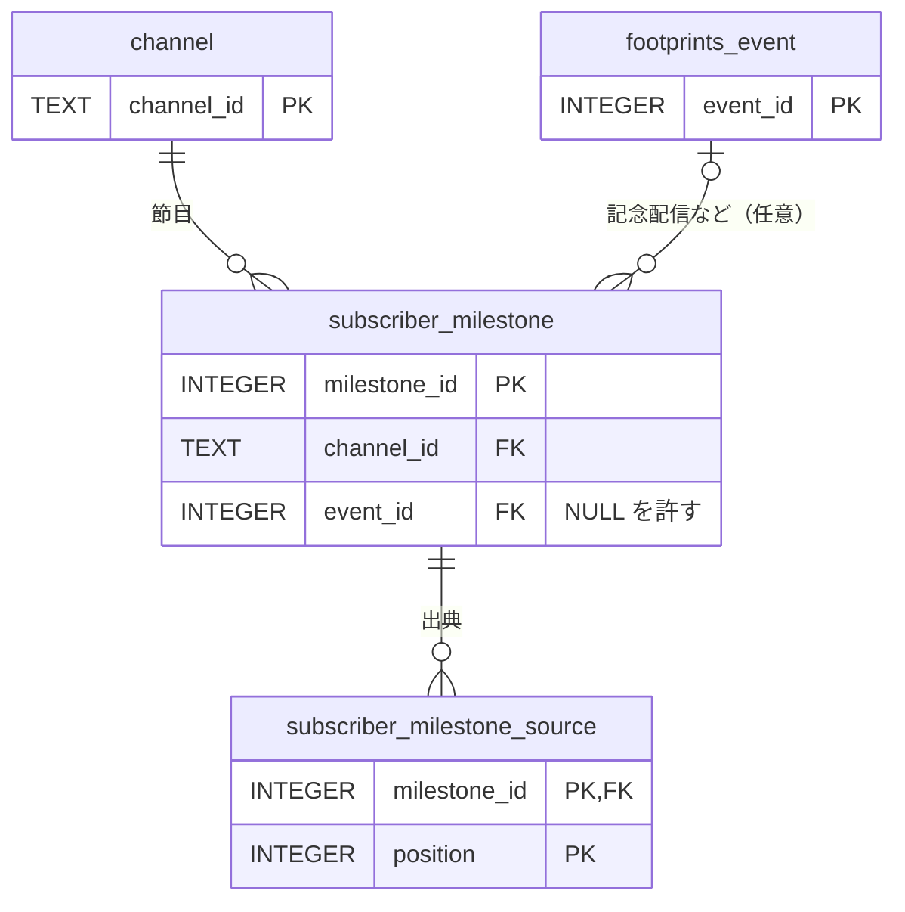
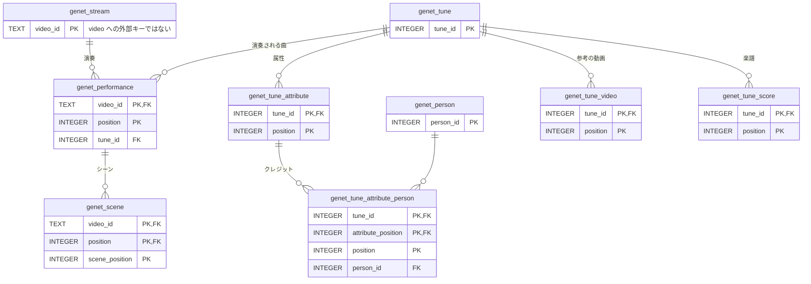
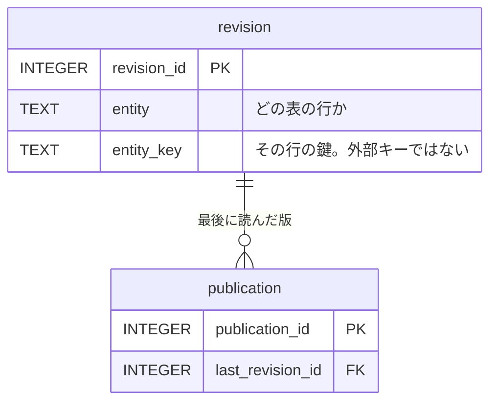
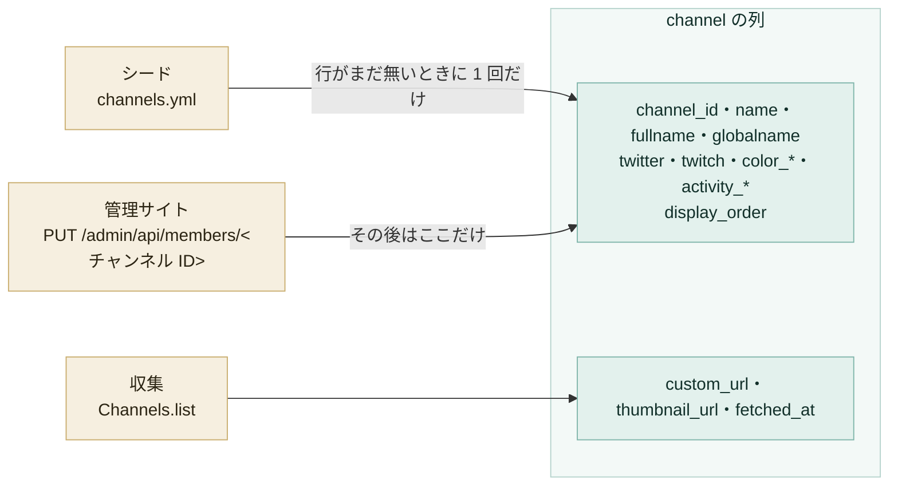
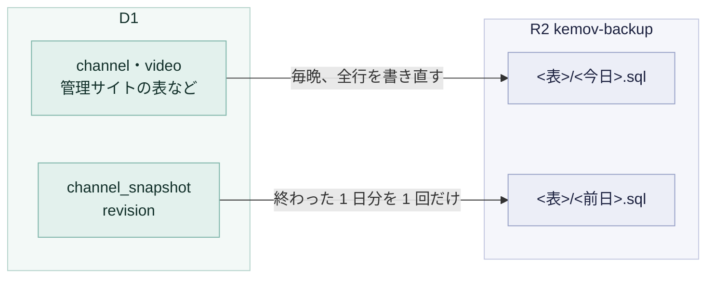

# データ

サイトのデータは D1 にあり、R2 にはバックアップと公開用の JSON を置きます。この文書は、どの列を誰が書くか、`channels.yml` の役目、バックアップとその保持期間、公開用のバケットを扱います。

## データベース

収集したデータは、Cloudflare D1 の `kemov` というデータベースにあり、APAC のリージョンで動いています。サイトが公開するものは、すべてここから作り直せます。この文書のコマンドは wrangler を使います。準備は [開発](../guides/development.md#worker-の開発) にあります。

リージョンはデータベースを作るときに決まり、後から変えられません。移すには、別のデータベースを作ってデータを写すことになります。

## 表の関係

表と外部キーは `migrations/` が決めます。次の図は、そこから主キー（PK）と外部キー（FK）の列だけを写したものです。すべての列は各マイグレーションのファイルにあります。

### 収集と、その上書き



### あしあと

```mermaid
erDiagram
  footprints_event ||--o{ footprints_event_member : "関わったメンバー"
  channel ||--o{ footprints_event_member : ""
  footprints_event ||--o{ footprints_event_source : "出典"
  footprints_event {
    INTEGER event_id PK
    TEXT video_id "外部キーではない"
  }
  footprints_event_member {
    INTEGER event_id PK, FK
    TEXT channel_id PK, FK
  }
  footprints_event_source {
    INTEGER event_id PK, FK
    INTEGER position PK
  }
  channel {
    TEXT channel_id PK
  }
  source_whitelist {
    TEXT prefix PK
  }
```



### 登録者数の節目



`subscriber_milestone` は、メンバー本人・公式・リスナーが公表した登録者数を、人が出典つきで記録する表です（#225）。`channel_snapshot` は 30 日しか持てないので、長い推移はこちらで持ちます。

- `reached_date` は、その人数に達した日（または月）。記念配信の日ではない
- `subscriber_count` は下限として読む。その日には少なくともその人数に達していた
- `announced_by` は、誰が公表したか（`member`・`official`・`listener`）
- `event_id` は、記念配信などのあしあとの出来事。つながなくてもよい

日付も人数も、YouTube API の値からは作りません（#222）。

### ジェネット楽曲一覧



### 版の履歴



`revision` は、`entity` と `entity_key` の組で、どの表のどの行の版かを示します。外部キーではないので、行を消しても版は残ります。

## 列の書き手

`channel` には書き手が 2 つあります。この分担を無視して書くと、もう一方の書いた内容を消してしまいます。



そのため、YAML から入れるシードは人が決める側の列だけを書き、しかも行がまだ無いときに限ります（[シード](#シード)）。

それ以外の表は、収集か管理サイト（[管理サイト](admin.md)）が書きます。両方が書くのは、管理サイトの収集の失敗の画面だけです。この画面は `collect_task` の行を更新し、`video.availability` を `unavailable` に確定することもあります。

## シード

リポジトリのルートの `channels.yml` は、`channel` の表のシードです。1 項目が 1 人のメンバーにあたります。

シードは行を足すだけです。`channel` に既にいるメンバーは、それ以降は管理サイトで直し、このファイルでは直しません。新しいメンバーの最初の `display_order` は、ファイルの中の順で決まります。これが、管理サイトで変えるまでサイトがメンバーを並べる順になります。並べ替える前に、ファイルの先頭のコメントを読んでください。

```yaml
- channel_id: UCEcMIuGR8WO2TwL9XIpjKtw
  name: ケープペンギン
  fullname: ケープペンギン / African Penguin
  globalname: African Penguin
  twitter: Cape_KEMOV
  color:
    key: '#F38E0A'
    sub: '#F8C112'
    light: '#FFEBA4'
    back: '#FFEBA4'
  activity_start_date: '2021-04-26'
  activity_end_date: '2022-05-21'
```

欄の名前は、書き込む先の列の名前と同じです。例外は `color` で、人が 4 つの値をまとめて直すのでまとめてあります。シードは、これを `color_key`・`color_sub`・`color_light`・`color_back` に分けて書きます。

- `globalname`・`twitter`・`twitch` は省いてよい
- `activity_end_date` は必ず書く
  - まだ活動中のメンバーは `null` と書く
  - キーを省いても同じ意味になるが、それでは誰かが決めた結果なのかが分からない
- 日付は引用符で囲む
  - 囲まないと、YAML は `2021-04-26` を文字列ではなく日時として読む。列は文字列を求める

以前の正データは、リポジトリの外に置いた手書きの JSON で、直してもレビューも検査も通りませんでした。このファイルは PR を通して直し、CI が PR ごとに読みます。

```sh
bun run check-channels
```

最初の 1 つで止まらず、ファイルの問題をすべてまとめて報告します。見つけるのは次のような問題です。

- YouTube のチャンネル ID の形でない ID
- `#RRGGBB` の形でない色
- `@` を付けて書いたハンドル
- 存在しない日付
- 綴りを誤った欄の名前
- 同じチャンネルの重複

検査の中身は `scripts/` にあります。CI の工程とデプロイの両方から、何もビルドしないうちに素の node で動かすので、TypeScript ではなく JavaScript で書いています。worker と同じく、vitest のプロジェクトを別に持っています。

```sh
bun run vitest run --project scripts
```

### メンバーが活動を終えたとき

管理サイトのメンバーの画面で、そのメンバーの `activity_end_date` を書きます。行は消しません。

`channels.yml` を書き換えても、この変更にはなりません。シードは行を足すだけなので、`channel` に既にいるメンバーの `activity_end_date` をファイルに書いても、何も変わりません。

`channel_snapshot` と `video` は `channel` を参照しているので、参照先を失わせる削除を D1 が拒みます。この拒否はわざとです。誤って消した行が、何年分もの収集の履歴を道連れにしてはなりません。活動を終えたメンバーにも、活動していたころの履歴は残ります。

### シードの入れ方

デプロイは、ファイルを 1 つの `INSERT ... ON CONFLICT DO NOTHING` に変えて適用します。手元のデータベースにも、同じ 2 つのコマンドで入れられます。

```sh
bun run build-channels-sql .wrangler/channels.sql
bun wrangler d1 execute kemov --local --file .wrangler/channels.sql
```

作った SQL はコミットしません。中身は実行した時点のファイルの内容そのもので、リポジトリに写しを置くと、ファイルと食い違いうるものが 1 つ増えるだけです。`.wrangler/` は git が無視するので、例ではそこへ書いています。

この文は人が決める側の列だけを名指しします。`custom_url`・`thumbnail_url`・`fetched_at` は、前回の収集が書いた値のまま残ります。文は行を足すだけです。表に既にあるチャンネルは、ファイルの今の内容にかかわらず、すべての列をそのまま保ちます。ファイルから消えたチャンネルも、行は残ります。

## バックアップ

[Time Travel](../guides/recovery.md#time-travel) で戻せるのは直近 30 日で、しかも D1 の中だけです。夜間のバックアップは、それより前のことと、D1 そのものに起きたことを受け持ちます。毎日 00:20 UTC（日本時間 9:20）に、worker がデータベースの中身を SQL として R2 のバケット `kemov-backup` へ書きます。

```text
channel/2026-09-08.sql              全行。毎晩書き直す
video/2026-09-08.sql                全行。毎晩書き直す
channel_snapshot/2026-09-07.sql     終わった 1 日分。1 回だけ書く
revision/2026-09-07.sql             終わった 1 日分。1 回だけ書く
publication/2026-09-08.sql          全行。毎晩書き直す
```



ほとんどの表は、今の値がすべてなので、毎晩まるごと書きます。`channel` と `video` のほか、[#144](https://github.com/nanase/kemov/issues/144) で管理サイトが足した表はすべてこちらです。

`channel_snapshot` と `revision` は違います。どちらも行が増える一方なので、終わった 1 日分を 1 つのファイルとして 1 回だけ書き、以後は触りません。これで 1 晩の仕事の量は、表の大きさではなく 1 日分の大きさで済みます。`channel_snapshot` の 1 日の行数は 144 × チャンネル数で、11 チャンネルなら 1 日 1,584 行、1 年で約 578,000 行になります。

1 回の実行が書くのは、抜けている日のうち最大 7 日分です。止まっていた期間の穴は、一度にすべて埋めようとせず、何晩かかけて埋まります。どの日を書き終えたかは、どこにも覚えておかず、バケットから読みます。そのため食い違う記録が生まれません。

ファイルの中の 1 つの `INSERT` は、最大 200 行、かつ最大 80,000 バイトで、先に達したほうで区切ります。D1 は 100,000 バイトを超える文を拒み、行数だけではバイト数が決まりません。

- 2026-09-08 に本番の `video` の 6,433 行で測ると、200 行ずつの区切りは、バックアップが読む順では最大 73,687 バイト、別の組み方では最大 86,890 バイトになった
- 上限にどこまで近づくかは、何行あるかではなく、どの行が同じ区切りに入るかで決まる
- `video` は増える一方

D1 が拒む文があっても、見つかるのはそのファイルから戻そうとしたときです。それは見つけるのに最も悪いタイミングです。

`collect_task` と `chat_author` は、わざとバックアップから外しています。どちらも収集がどこまで進んだかを持つだけで、1〜2 回の tick で作り直されます。戻すと、チャットのジョブが読み終えたリプレイをもう一度読むことになります。

[#115](https://github.com/nanase/kemov/issues/115) から、`/api/health` はこのジョブも見ています。このジョブは `collect_task` の行を書かないので、`/api/health` の `backup` 欄はバケットを読みます。表ごとに、ファイルのある最新の日と、それが何日前かを返します。`channel_snapshot` と `revision` は、今日ではなく前日の終わった 1 日分を書くので、何も起きていなくても他の表より 1 日古く出ます。どれだけ古ければ異常かは、この欄は示しません。その閾値は [#110](https://github.com/nanase/kemov/issues/110) が決めます。

## 保持期間

`kemov-backup` には、既にある Default Multipart Abort Rule に加えて、prefix ごとのライフサイクルルールを置いています。バケット全体に 1 つの規則をかけると、どこかの prefix で誤りになるためです。規則の設定の手順は [設定とデプロイ](../guides/deployment.md#バックアップのバケットの保持期間) にあります。

| prefix   | 保持期間 | 理由                                                                                                  |
| -------- | -------- | ----------------------------------------------------------------------------------------------------- |
| `video/` | 30 日    | ファイルはどれも完全な写しで、YouTube API から取り直せる。最新の 1 つがあれば足り、古いものは重複する |
| 次の一覧 | 365 日   | 次を参照                                                                                              |

365 日の規則を置く prefix は、`channel/`・`channel_snapshot/`・`channel_snapshot_exclusion/`・`video_override/`・`footprints_event/`・`footprints_event_member/`・`footprints_event_source/`・`subscriber_milestone/`・`subscriber_milestone_source/`・`source_whitelist/`・`genet_person/`・`genet_tune/`・`genet_tune_attribute/`・`genet_tune_attribute_person/`・`genet_tune_video/`・`genet_tune_score/`・`genet_stream/`・`genet_performance/`・`genet_scene/`・`revision/`・`publication/` です。

`channel_snapshot/` と `revision/` は 1 日に 1 ファイルで、その日を持つファイルは他にありません。1 つ消えれば、何も埋められない穴になります。

ただし、それは R2 の中の穴で、履歴そのものの穴ではありません。どちらの表も D1 の中で行が増える一方なので（[バックアップ](#バックアップ)）、D1 はどの日も持ち続けています。R2 の写しは、D1 が壊れたときに D1 を戻すためにあります。その必要は障害の直後に来るもので、1 年後には来ません。365 日は、写しがその出番を待つ期間の上限であって、履歴が残る期間ではありません。

365 日の側の他の表は、収集が取り直せるデータではなく、人が管理サイトで一度だけ入力したデータを持ちます。`channel` も、人が直す表になったことで、同じ理由からこちらに入りました。この理屈が当てはまらないのは `video/` だけです。YouTube API から取り直せるので、30 日分を失っても、作り直しが遅くなる以上の損はありません。

量の見積もりは次のとおりです。どれも 2026-09-08 に本番の値で測りました。

- スナップショットの履歴は 2026-09-07 に始まり、R2 の他の場所には無い
- その 1 日分は SQL で約 119 KiB なので、1 年分で約 44 MB
- `video` は 30 日分で約 70 MB を足す。`channel` の数十行は、この数字をほとんど動かさない
- どちらも R2 の無料枠 10 GB に十分収まる。#144 で足した表は、どれも多くて数百行で、ほとんど足さない

## 公開用のデータ

管理サイトは、JSON を専用のバケット `kemov-public` へ公開します。worker からは `PUBLIC_DATA` というバインディングで読み書きします（#144）。ライフサイクルルールは置きません。公開は毎回同じキーを上書きするので、規則で期限切れにする古いオブジェクトが生まれないためです。

このバケットはバックアップしません。公開したオブジェクトはすべて `revision` から作り、`revision` はバックアップしています。`kemov-public` を失っても、失うのはデータではなく、公開し直す手間だけです。`collect_task` と `chat_author` を `kemov-backup` から外す（[バックアップ](#バックアップ)）のと同じ理屈を、表ではなくバケットに当てはめています。

管理サイトの公開の操作がこのバケットに書き（[あしあと](api/admin.md#あしあと)、[ジェネット楽曲一覧](api/admin.md#ジェネット楽曲一覧)、[登録者数の節目](api/admin.md#登録者数の節目)）、`/api` がそれを返します（[公開の API](api/public.md#公開用のバケットを返すエンドポイント)）。

バケットの作り方は [設定とデプロイ](../guides/deployment.md#公開用のバケット) にあります。
